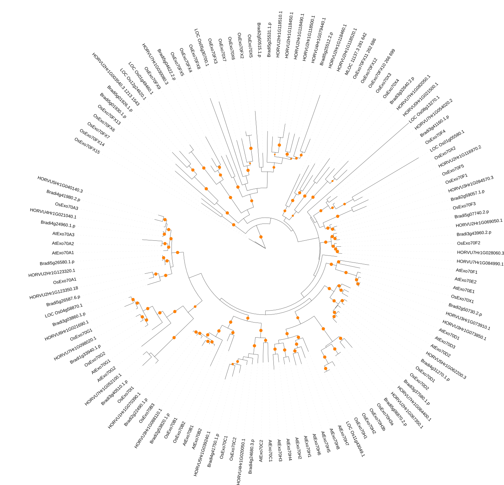
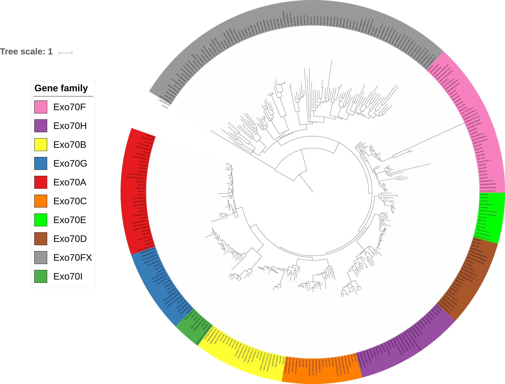
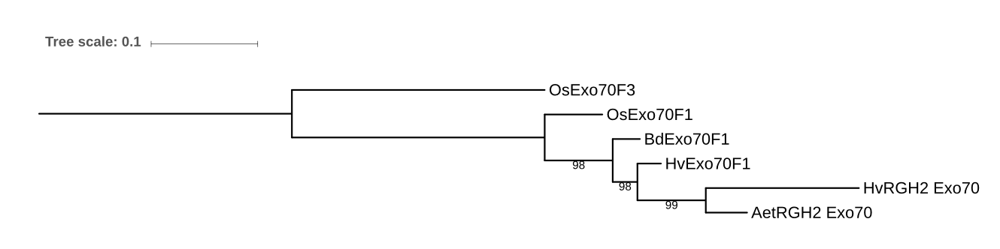
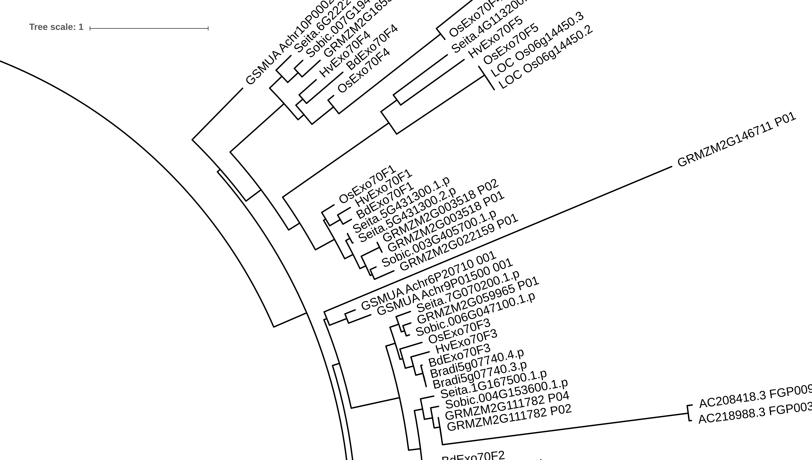
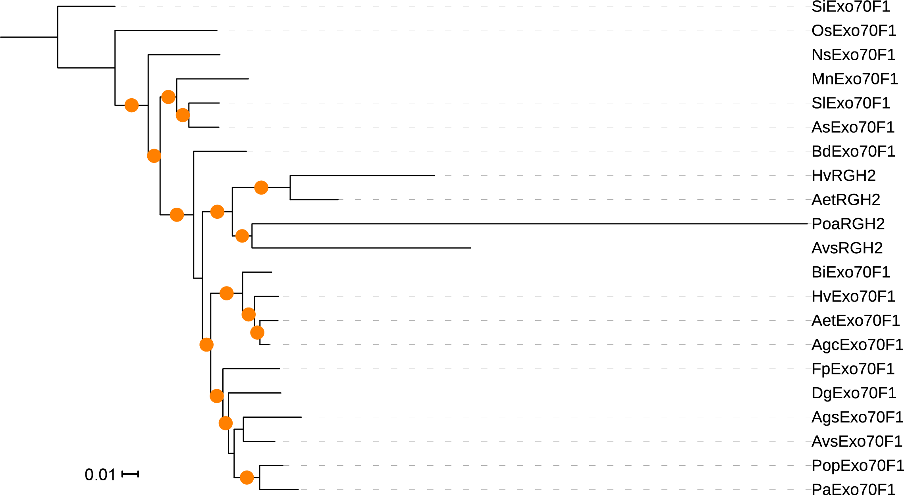
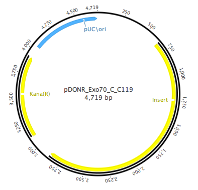

# Analysis of Exo70 gene family and NLR-Exo70

## Introduction
We describe the annotation of the Exo70 gene family from barley and integrate the identified genes within existing resources from *Brachypodium distachyon*, *Oryza sativa*, and *Arabidopsis thaliana*. Using resequencing data from a diverse panel of accessions in *Hordeum vulgare* and *Brachypodium distachyon*, we assess nucleotide diversity and presence/absence variation. Next, we assess tissue-dependent gene expression in *Hordeum vulgare* for the Exo70 gene families and associate with existing knowledge in *Arabidopsis thaliana*. Lastly, we analyze the integration of Exo70 into nucleotide binding, leucine-rich repeat (NB-LRR) proteins.

## Annotation and phylogenetic tree of Exo70 from *Hordeum vulgare*, *Brachypodium distachyon*, *Oryza sativa*, and *Arabidopsis thaliana*
### Exo70 gene family in *Hordeum vulgare*
During the course of this analysis, two different genome annotations of barley were used. Initially, the annotation from the IBGSC (2012) *Nature* paper identified 35 proteins containing an Exo70 domain (Pfam PF03081). Later, the annotation from the Mascher *et al.* (2017) *Nature* identified 33 proteins containing an Exo70 domain. Multiple sequence alignment of the protein sequence from the 2012 and 2017 genomes found that the majority of genes were present in both annotations, with the exception of of MLOC_11137.3, MLOC_22709.1, and MLOC_45983.4 in the 2012 annotation and HORVU2Hr1G118460.1, HORVU2Hr1G118490.1 in the 2017 annotation.

**Table 1.** Inconsistent gene models between barley genome annotations from 2012 and 2017.

|Gene              |Issue                     |Reason                                               |
|:-----------------|:-------------------------|:----------------------------------------------------|
|MLOC_11137.3      |Missing in 2017 annotation|Present in genome sequence (2012), contig_1560470    |
|MLOC_22709.1      |Missing in 2017 annotation|Truncated gene model, part of HORVU5Hr1G040140.3     |
|MLOC_45983.4      |Missing in 2017 annotation|Present in genome sequence (2012), contig_283847     |
|HORVU2Hr1G118460.1|Missing in 2012 annotation|Present in genome sequence (2012), missed previously?|
|HORVU2Hr1G118490.1|Missing in 2012 annotation|Present in genome sequence (2012), missed previously?|

MLOC_45983.4 encodes a truncated Exo70 domain, whereas MLOC_11137.3 is present in the 2017 annotation of the barley genome, although as an alternative gene model from the reference set (HORVU3Hr1G094660). Two genes in barley, HORVU5Hr1G039240.1 and HORVU7Hr1G082050.1, had substantial missing data for the open reading frame due to ambiguous bases within the gene model.

The final set of barley Exo70 includes 34 proteins (33 from 2017, 1 from 2012) with an additional sequence derived from the transcriptome of Baronesse (*RGH2*).

### Exo70 gene family in *Brachypodium distachyon*
In total, 34 proteins with Exo70 domains were extracted from the *Brachypodium distachyon* genome version 3.1 from the Department of Energy-Joint Genome Institute. 

### Exo70 gene family in *Oryza sativa*
In total, 66 proteins with Exo70 domains were extracted from the *Oryza sativa* genome version 7 from Michigan State University Rice Genome Annotation Project. 

### Exo70 gene family in *Arabidopsis thaliana*
In total, 23 proteins with Exo70 domains were extracted from the *Arabidopsis thaliana* genome version 10 from TAIR.

### Phylogenetic tree of the Exo70 gene family
#### Domain characterization
InterProScan was used to assess all putative Exo70 domain containing proteins to define the Exo70 domain region and additional domains associated with Exo70 domains. To assess the domain architecture of Exo70 proteins, we used the [QKdomain](https://github.com/matthewmoscou/QKdomain) (v1.0) suite of scripts to identify the diversity of domains. 

```bash
python QKdomain_preprocess.py Exo70_all.fa.tsv Exo70_v3_all_preprocess_summary.txt Exo70_abbreviations.txt
```

**Table 2.** Protein domains associated with the Exo70 gene family in *Arabidopsis thaliana*, *Brachypodium distachyon*, *Hordeum vulgare*, and *Oryza sativa*.

|Domain identifier|Software       |Domain type                                        |Genes with domain|Total observed domains|Average domain length|Abbreviation|
|:---------------:|:-------------:|:--------------------------------------------------|:---------------:|:--------------------:|:-------------------:|:----------:|
|SSF74788         |SUPERFAMILY    |Cullin repeat-like-containing domain               |       141       |         216          |         285.0       |   Exo70    |
|PF03081          |Pfam           |Exocyst complex component Exo70                    |       141       |         144          |         309.4       |   Exo70    |
|Coil             |Coils          |Coiled coil                                        |        22       |          23          |          19.7       |      CC    |
|SSF52402         |SUPERFAMILY    |                                                   |         4       |           4          |         104.8       |      NB    |
|SSF53756         |SUPERFAMILY    |                                                   |         2       |           2          |          60.0       |     UGP    |
|PF00931          |Pfam           |NB-ARC                                             |         1       |           2          |         147.0       |      NB    |
|PF01612          |Pfam           |3'-5' exonuclease domain                           |         1       |           1          |         104.0       |    ExoI    |
|PS50077          |ProSiteProfiles|HEAT, type 2                                       |         1       |           1          |          40.0       |    HEAT    |
|SSF52058         |SUPERFAMILY    |Leucine-rich repeat domain, L domain-like          |         1       |           1          |         317.0       |     LRR    |
|SSF53098         |SUPERFAMILY    |Ribonuclease H-like domain                         |         1       |           1          |         112.0       |   RiboH    |
|SSF52540         |SUPERFAMILY    |P-loop containing nucleoside triphosphate hydrolase|         1       |           1          |         219.0       |      NB    |

The association of NB and LRR domains is due to the integration of several Exo70 from grasses into NB and NB-LRR genes.

**Table 3.** Domain architecture of genes containing a nucleotide binding (NB) domain.

|Gene               |Domain architecture|
|:------------------|:-----------------:|
|LOC_Os07g10910.1   |       NB-Exo70    |
|LOC_Os07g10910.2   |       NB-Exo70    |
|LOC_Os07g10940.1   |       NB-Exo70    |
|MLOC_11137.3       |    NB-CC-Exo70    |
|HORVU2Hr1G003540.3 |   NB-LRR-Exo70    |

The nucleotide binding (NB) exhibited in LOC_Os07g10910 (two alternate gene models), LOC_Os07g10940, and MLOC_11137.3 is more closely associated with serine/threonine protein kinases rather than NB-LRRs. HORVU2Hr1G003540.3 is a NB-LRR with an integrated Exo70, similar to others that have been observed. The identifier for HORVU2Hr1G003540.3 in the [barleyNLRome](https://github.com/matthewmoscou/barleyNLRome) analysis is 2097|m.19808. The implication of Exo70 integration in NB-LRRs will be discussed in more detail below. To generate a phylogenetic tree of the Exo70 gene family, we used three strategies for aligning Exo70 proteins:
* Alignment of full length Exo70 proteins
* Alignment of the Exo70 domain only
* Alignment of full length Exo70 proteins using GUIDANCE2

#### Alignment of full length Exo70 proteins
We first evaluated the protein domain structure using `QKdomain_process.py` with default parameters to identify proteins with non-Exo70 domains.

```bash
python QKdomain_process.py -d Exo70 Exo70_v3_all.fa Exo70_v3_all.fa.tsv Exo70_abbreviations.txt Exo70_v3_all_process_summary.txt Exo70_v3_all_Exo70.fa
```

Full length Exo70 genes were included in the multiple sequence alignment, except for genes listed in **Table 3**, where the Exo70 domain region was extracted from the gene based on `QKdomain`. A single gene model was selected at each gene locus for the analysis. Several multiple sequence alignments were performed on the [138 Exo70 genes](data/Exo70_AtBdHvOs.fa) including CLUSTALW2, MUSCLE, and MAFFT. The *Saccharomyces cerevisiae* Exo70 gene (YJL085W) was included for subsequent use as an outgroup in phylogenetic analyses.

```bash
clustalw2 -infile=Exo70_AtBdHvOs.fa -type=protein -matrix=pam -outfile=Exo70_AtBdHvOs_CLUSTALW2.aln -outorder=input
muscle -in Exo70_AtBdHvOs.fa -out Exo70_AtBdHvOs_MUSCLE.aln -clwstrict
mafft --clustalout --thread 4 Exo70_AtBdHvOs.fa > Exo70_AtBdHvOs_MAFFT.aln
```

CLUSTALW2 and MUSCLE gave alignments that were similar in length (1,108 and 1,199, respectively), whereas MAFFT gave an alignment length of 1,877 aa. The topology of the neighbor joining phylogenetic trees for MUSCLE and MAFFT were similar, whereas CLUSTALW2 created aberrant branch lengths. The MUSCLE alignment was selected for subsequent analyses. After alignment, it was found that the following sequences were redundant. They were subsequently removed for phylogenetic tree construction.

**Table 4.** Redundant proteins in Exo70 multiple sequence alignment.

|Retained gene model|Redundant gene model|
|:-----------------:|:------------------:|
|LOC_Os11g42989.1   |LOC_Os11g43049.1    |
|AT5G61010.1        |AT5G61010.2         |
|LOC_Os06g14450.1   |LOC_Os06g14450.2    |
|LOC_Os06g14450.1   |LOC_Os06g14450.3    |

#### Generation of phylogenetic tree using full length Exo70 proteins
The maximum likelihood phylogenetic tree was constructed using RAxML with the JTT amino acid substitution model.

```bash
raxml -s exo70_alignment.phy.reduced -n EXO70_MULTIGAMMA -m PROTGAMMAJTT -p 654967019 -T 4
```

#### Bootstrap analysis of phylogenetic tree using full length Exo70 proteins
Bootstrap support was generated using 300 bootstraps. Convergence of bootstraps was determined using the `autoMRE` command in RAxML and was met after 250 bootstraps.

```bash
raxml -s exo70_alignment.phy.reduced -n EXO70_MULTIGAMMA_bootstrap_r1 -m PROTGAMMAJTT -N 100 -p 5247757188 -T 4
raxml -s exo70_alignment.phy.reduced -n EXO70_MULTIGAMMA_bootstrap_r2 -m PROTGAMMAJTT -N 100 -p 9236245951 -T 4
raxml -s exo70_alignment.phy.reduced -n EXO70_MULTIGAMMA_bootstrap_r3 -m PROTGAMMAJTT -N 100 -p 7483262134 -T 4
cat RAxML_parsimonyTree.EXO70_MULTIGAMMA_bootstrap_r* > allBootstraps
raxml -z allBootstraps -m PROTGAMMAJTT -I autoMRE -n TEST -p 8147553599
```

We use the `-f b` command in RAxML to add the bootstrap values to the phylogenetic tree.

```bash
raxml -f b -z allBootstraps -t RAxML_result.EXO70_MULTIGAMMA -m PROTGAMMAJTT -n EXO70_FL
```

All analyses can be found in the file `data\phylogenetic_analysis.tar.gz`. Next, we extract the node labels from the phylogenetic tree.

```bash
python QKphylogeny_nodelabels.py -t RAxML_bipartitionsBranchLabels.EXO70_FL -o RAxML_bipartitionsBranchLabels.EXO70_FL_nodelabels
```

#### Visualization of phylogenetic tree using full length Exo70 proteins
Gene identifers were converted into human readable format using `QKphylogeny_rename_nodes.py` based on the annotation from [Cvrčková *et al.* (2012) *Frontiers in Plant Science*](https://doi.org/10.3389/fpls.2012.00159). 

```bash
python QKphylogeny_rename_nodes.py -t RAxML_bipartitionsBranchLabels.EXO70_FL -o RAxML_bipartitionsBranchLabels.EXO70_FL_ID -l Exo70_gene_identifiers.txt
```
The phylogenetic tree was visualized using [EMBL iTOL](http://itol.embl.de) as shown below. The phylogenetic tree was rooted based on ScExo70. Topological features of individual Exo70 protein families were added based on prior knowledge from *Arabidopsis thaliana* and *Oryza sativa*, and bootstrap support within the phylogenetic tree using the iTOL [TREE_COLORs](data/iTOL_colors_style_exo70_type.txt). 



#### Analysis of phylogenetic tree using full length Exo70 proteins
The phylogenetic tree was used to:
* Define gene families based on *Arabidopsis thaliana* and *Oryza sativa* annotation,
* Assess expansion of gene families, and
* Identify the loss of genes.

Species-specific grouping of orthologous gene families was observed for *Arabidopsis thaliana*, although the majority of gene families were supported. The only exception was AtExo70F1, where bootstrap support was not present for grouping within the Exo70F clade of *Oryza sativa*, *Hordeum vulgare*, and *Brachypodium distachyon*.

Corrections were made to gene symbols based on the phylogenetic tree. This includes two Exo70 encoding genes, OsExo70X2 and Os01g05580.1, that were members of the OsExo70F4 clade and were designated OsExo70F4b and OsExo70F4c, respectively. The clade including the AtExo70E gene family contains one rice (OsExo70X1), one *Brachypodium distachyon* (Bradi2g50730.2.p), and two barley Exo70 proteins (HORVU3Hr1G073850.1 and HORVU3Hr1G073910.1). These genes have been reassigned the identifiers OsExo70E1, BdExo70E1, HvExo70E1a, and HvExo70E1b, respectively.

Expansion/contraction of Exo70 gene families was observed in several cases and is shown below in **Table 5**.

**Table 5.** Expansion/contraction in Exo70 gene family in grass species.

|Gene family|*O. sativa*|*H. vulgare*|*B. distachyon*|
|:---------:|:---------:|:----------:|:-------------:|
|Exo70A     |      3    |      4     |        4      |
|Exo70B     |      3    |      2     |        2      |
|Exo70E     |      1    |      2     |        1      |
|Exo70F2    |      1    |      2     |        1      |
|Exo70H     |      4    |      1     |        1      |

Note: Check original IDs to confirm not alternate gene models.

Using evolutionary relationships of *Oryza sativa*, *Hordeum vulgare*, and *Brachypodium distachyon*, we can hypothesize that the gene families of:
* Exo70A, expansion in *H. vulgare* and *B. distachyon*
* Exo70B, expansion in *O. sativa*
* Exo70E and Exo70F2, expansion in *H. vulgare* or loss in *B. distachyon*
* Exo70H, expansion in *O. sativa*
* Exo70F5, loss of gene in *B. distachyon*

Previous observations of extensive expansion within the Exo70FX clade in *Oryza sativa* was supported in *Hordeum vulgare* and *Brachypodium distachyon*. Orthologous relationships are unclear for the majority of this gene family, therefore no attempt was made to associate identifiers between species. 

### Expanded phylogenetic tree using diverse sequenced monocot species
To understand the expansion and evolution of Exo70 gene families in the monocots (such as *Exo70F* and *Exo70FX*), we identified additional sequenced monocot species on Phytozome from the Department of Energy-Joint Genome Institute.

#### Exo70 gene family in *Annas comosus* (pineapple)
In total, 14 proteins with Exo70 domains were extracted from the *Annas comosus* genome version 321_v3 from the Department of Energy-Joint Genome Institute. 

#### Exo70 gene family in *Musa acuminata* (banana)
In total, 28 proteins with Exo70 domains were extracted from the *Musa acuminata* genome version 304_v1 from the Department of Energy-Joint Genome Institute. 

#### Exo70 gene family in *Sorghum bicolor*
In total, 46 proteins with Exo70 domains were extracted from the *Sorghum bicolor* genome version 454_v2.2 from the Department of Energy-Joint Genome Institute. 

#### Exo70 gene family in *Setaria italica*
In total, 54 proteins with Exo70 domains were extracted from the *Setaria italica* genome version 312_v2.2 from the Department of Energy-Joint Genome Institute. 

#### Exo70 gene family in *Spirodela polyrhiza*
In total, 18 proteins with Exo70 domains were extracted from the *Spirodela polyrhiza* genome version 290_v2 from the Department of Energy-Joint Genome Institute. 

#### Exo70 gene family in *Zea mays*
In total, 47 proteins with Exo70 domains were extracted from the *Zea mays* genome version 284_Ensembl-18_2010-01 from the Department of Energy-Joint Genome Institute. 

#### Multiple sequence alignment of expanded phylogenetic tree
Full length Exo70 genes were included in the multiple sequence alignment including those previously used to construct the *Hordeum vulgare*, *Brachypodium distachyon*, *Oryza sativa*, and *Arabidopsis thaliana*. Manual curation was performed on the data set with the removal of alternate gene models for single loci and removal of sequence preceding the first methionine. This was a common feature of the *Hordeum vulgare* protein data set, and to a lesser degree *Setaria italica*. From an initial set of [366 Exo70 genes](data/Exo70_AtBdHvOs_monocot.fa), multiple sequence alignment was performed with [318 Exo70 genes](data/Exo70_AtBdHvOs_monocot_nr.fa) using [MUSCLE](data/Exo70_AtBdHvOs_monocot_MUSCLE.aln). The *Saccharomyces cerevisiae* Exo70 gene (YJL085W) was included for subsequent use as an outgroup in phylogenetic analyses.

```bash
muscle -in Exo70_AtBdHvOs_monocot_nr.fa -out Exo70_AtBdHvOs_monocot_MUSCLE.aln -clwstrict
```

The multiple sequence alignment had a length of 2,529 aa. Manual curation was made on the multiple sequence alignment to remove sequence on N-terminal and C-terminal unique to only single Exo70 proteins. This generated an initial [alignment](data/Exo70_AtBdHvOs_monocot_MUSCLE.phy) length of 2,046 aa.

#### Generation of expanded phylogenetic tree using full length Exo70 proteins
The maximum likelihood phylogenetic tree was constructed using RAxML with the AUTO amino acid substitution model. The selected amino acid substitution model was JTT.

```bash
raxml -s Exo70_AtBdHvOs_monocot_MUSCLE.phy -n Exo70_AtBdHvOs_monocot -m PROTGAMMAAUTO -p 347123894213321 -T 4
```

#### Bootstrap analysis of phylogenetic tree using full length Exo70 proteins
Bootstrap support was generated using XXX bootstraps. Convergence of bootstraps was determined using the `autoMRE` command in RAxML and was met after XXX bootstraps.

```bash
raxml -s Exo70_AtBdHvOs_monocot_MUSCLE.phy -n Exo70_AtBdHvOs_monocot_bootstrap_r1 -m PROTGAMMAAUTO -N 100 -p 5463297105643 -T 32
raxml -s Exo70_AtBdHvOs_monocot_MUSCLE.phy -n Exo70_AtBdHvOs_monocot_bootstrap_r2 -m PROTGAMMAAUTO -N 100 -p 4236472395119 -T 32
raxml -s Exo70_AtBdHvOs_monocot_MUSCLE.phy -n Exo70_AtBdHvOs_monocot_bootstrap_r3 -m PROTGAMMAAUTO -N 100 -p 6574185469431 -T 32
raxml -s Exo70_AtBdHvOs_monocot_MUSCLE.phy -n Exo70_AtBdHvOs_monocot_bootstrap_r4 -m PROTGAMMAAUTO -N 100 -p 6485921568143 -T 32
raxml -s Exo70_AtBdHvOs_monocot_MUSCLE.phy -n Exo70_AtBdHvOs_monocot_bootstrap_r5 -m PROTGAMMAAUTO -N 100 -p 7857483295341 -T 32
cat RAxML_parsimonyTree.Exo70_AtBdHvOs_monocot_bootstrap_r* > allBootstraps
raxml -z allBootstraps -m PROTGAMMAJTT -I autoMRE -n TEST -p 8147553599
```

We use the `-f b` command in RAxML to add the bootstrap values to the phylogenetic tree.

```bash
raxml -f b -z allBootstraps -t RAxML_result.Exo70_AtBdHvOs_monocot_bootstrap -m PROTGAMMAAUTO -n EXO70_AtBdHvOs_monocot_bootstraps
```

Bootstraps are ongoing, once completed all data will be deposited into the file `data\phylogenetic_analysis_extended_monocot.tar.gz`. Next, we extract the node labels from the phylogenetic tree.

```bash
python QKphylogeny_nodelabels.py -t RAxML_bipartitionsBranchLabels.EXO70_FL -o RAxML_bipartitionsBranchLabels.EXO70_FL_nodelabels
```

#### Visualization of phylogenetic tree using full length Exo70 proteins
Gene identifers were converted into human readable format using `QKphylogeny_rename_nodes.py` based on the annotation from [Cvrčková *et al.* (2012) *Frontiers in Plant Science*](https://doi.org/10.3389/fpls.2012.00159). 

```bash
python QKphylogeny_rename_nodes.py -t RAxML_bipartitionsBranchLabels.EXO70_FL -o RAxML_bipartitionsBranchLabels.EXO70_FL_ID -l Exo70_gene_identifiers.txt
```
The phylogenetic tree was visualized using [EMBL iTOL](http://itol.embl.de) as shown below. The phylogenetic tree was rooted based on ScExo70. Topological features of individual Exo70 protein families were added based on prior knowledge from *Arabidopsis thaliana* and *Oryza sativa*, and bootstrap support within the phylogenetic tree using the iTOL [TREE_COLORs](data/iTOL_colors_style_exo70_type.txt). 




---
### Todo
Below are analyses that will be performed at a later date.

### Assessment of positions within the multiple sequence alignment using GUIDANCE
```bash
~/src/guidance.v2.02/www/Guidance/guidance.pl --seqFile Exo70_AtBdHvOs.fa --msaProgram MAFFT --seqType aa -outDir Exo70_AtBdHvOs_GUIDANCE --proc_num 4
```

### Identification of novel motifs within Exo70 genes
Use the existing pipeline within QKdomain to identify all sequences not associated with Exo70 domains and identify additional conserved motifs.

---

## Evolution of Exo70 genes
### Nucleotide diversity in Exo70 genes
Are there additional Exo70 that are integrated in NB-LRR that exist as allelic variants?
Presence/absence variation relative to other sequenced genomes? (Confirm with BLAST)

## Transcriptional dynamics of Exo70 genes
### Tissue-dependent gene expression in *Hordeum vulgare* for the Exo70 gene family
Alignment of RNAseq data from barley tissue data sets onto Exo70 gene families.
Need to extract the genomic regions encompassing Exo70 genes with GFF files.
Perform clustering analysis, look for general trends in tissue-specificity within each clade.
Particular attention to the Exo70F and Exo70FX clades.

## Evolutionary history of NLR/Exo70 association
### Exo70 integrations within NLRs
An analysis that can occur would look across all plant species for the integration of Exo70 into NLRs. Questions include (1) are there intregrations in other species?, (2) do they all have the same orientation?, and (3) are all Exo70 derived from the same group? (we already know the answer is no, Exo70F and Exo70FX).

---

**Question:** What is the time of integration of the *Exo70F* into *RGH2*.
* What is the origin of *Exo70F* integrated domain?
* How much sequence from the origin was integrated into the *RGH2* locus?
* Does allelic variation exist outside *Hordeum vulgare*?

Experimental approaches:
* dN / dS ratio can be used to assess the variation in non-synonymous and synonymous sites between allelic variants of RGH2-Exo70 in barley and the wheat homolog.
* Assess the non-synonymous and synonymous sites between allelic variants of RGH2-Exo70 in barley without an Exo70 integration.
* Is the origin of the *Exo70F* integrated domain under positive or purifying selection? Within *Hordeum vulgare* and compared to *Brachypodium distachyon* and *Oryza sativa*.

---

**Question:** Is the integrated Exo70F a functional Exo70? (Functional, non-functional (decoy), subfunctionalization, or neofunctionalization)
* Alternative hypothesis: The integration of Exo70F simply provide specific localization of *RGH2* for immune signalling.

Knowledge required for developing experimental approaches:
* Gene expression of *Exo70F* genes to ascertain tissue specificity and potential biological role.

Experimental approaches:
* Recreate the original protein through fusion of the missing N-terminal sequence with its origin (in parallel with native promoter and terminator).
* Design an approach to complement a deficient knockout of the origin of the integrated *Exo70F*.
* Perform yeast 2-hybrid assays that demonstrate the ability to bind exocyst components, similar to the origin.
* Show similar localization patterns of the origin and integrated *Exo70F*.

---

**Question:** Is the toplogy of all phylogenetic trees of orthologous Exo70 gene families identical to the species tree?

---

**Question:** Does the *Brachypodium distachyon* homolog of RGH2-Exo70 have allelic variation for integration other than a lectin domain?

**Question:** Is their an *Mla* haplotype that has alternate haplotypes of RGH2 integrated domains other than Exo70?

---

**Hypothesis:** The *Exo70F* gene family is under strong diversifying selection.
The rationale is that several members of the *Exo70F* gene family are the target of effectors.

Experimental approaches:
* Investigate the number of genes within the *Exo70F* gene family. (Also *Exo70FX*).
* Perform pairwise comparisons among species for every orthologous group to test for diversifying selection.

---

**Question:** What is the process of integration for *Exo70F*?
* Are there signatures within *RGH2* that permit integration of Exo70?
* Do these signatures exist within integrated alleles but lack in non-integrated alleles?

---

**Analysis**

First, we need to assess the degree of identity at the nucleotide/protein level of NB-LRR and Exo70 encoding domains within RGH2 and Exo70 genes/proteins.

Alignment of RGH2 (Morex), RGH2 (Baronesse), and RGH2 (*Aegilops tauschii*) found alignment to the following amino acid positions:
* 2312|m.12779 at 975 aa
* RGH2 (Baronesse) at 975 aa
* RGH2 (*Aegilops tauschii*) at 961 aa

**Table 1.** Pairwise nucleotide/protein identity of RGH2 from *Hordeum vulgare* and *Aegilops tauschii*. Upper right is nucleotide identity, lower left is protein identity.

|              |RGH2 Ta|RGH2 Morex|RGH2 Baronesse|
|:-------------|:-----:|:--------:|:------------:|
|RGH2 Ta       |    -  |   91.9   |     92.2     |
|RGH2 Morex    | 89.3  |      -   |     95.3     |
|RGH2 Baronesse| 89.4  |   92.4   |        -     |

**Conclusion:** Greater intraspecific than interspecific identity is observed in RGH2 at the nucleotide and protein level for the NB-LRR encoding region of *RGH2*. This observation does not specifically exclude the hypothesis that the integration preceded speciation, as gene conversion can contribute to higher interspecific gene identity.

Alignment of HvExo70F1 (HORVU3Hr1G094570.3; Morex), Exo70F-ID (RGH2; Baronesse), and Exo70-ID (RGH2; *Aegilops tauschii*) found that alignment starts at the following amino acid positions:
* Exo70F1 (HORVU3Hr1G094570.3; Morex) at 98 aa
* RGH2 (Baronesse) at 1033 aa
* RGH2 (*Aegilops tauschii*) at 1048 aa
* Exo70F1 (*Brachypodium distachyon*) at 98 aa
* Exo70F1 (Os01g69230.1; *Oryza sativa*) at 75 aa

**Table 2.** Pairwise nucleotide/protein identity of Exo70F1 from *Hordeum vulgare*, *Brachypodium distachyon*, and *Oryza sativa* including the *RGH2* region encoding the Exo70 integrated domains from *Hordeum vulgare* and *Aegilops tauschii*. Upper right is nucleotide identity, lower left is protein identity.

|              |OsExo70F1|BdExo70F1|HvExo70F1|RGH2 Ta|RGH2 Baronesse|
|:-------------|:-------:|:-------:|:-------:|:-----:|:------------:|
|OsExo70F1     |     -   |  85.3   |  84.1   |  72.5 |    72.3      |
|BdExo70F1     |  84.3   |     -   |  90.6   |  77.8 |    77.1      |
|HvExo70F1     |  81.5   |  92.0   |     -   |  76.9 |    76.8      |
|RGH2 Ta       |  66.8   |  72.9   |  72.0   |     - |    87.2      |
|RGH2 Baronesse|  65.5   |  70.8   |  70.5   |  79.8 |       -      |

**Conclusion:** Several results can be derived from this dataset:
1. *Exo70F1* from barley and Brachypodium share substantially higher identity at the nucleotide and protein level than with rice *Exo70F1*.
2. The integrated *Exo70F1* in barley and wheat share substantially higher identity at the nucleotide and protein level than with *Exo70F1* from barley, Brachypodium, and rice.

This is a striking result, as it suggests that the integrated Exo70F1 shares the same identity 

**Table 3.** Synonymous, non-synonymous, and Ka/Ks ratio for pairwise analysis of *RGH2* from *Hordeum vulgare* and *Aegilops tauschii*.

|Protein 1      |Protein 2    |dS-yn|dN-yn|dS-ng|dN-ng|dN/dS-yn|
|:--------------|:------------|:---:|:---:|:---:|:---:|:------:|
|2312 m.12779   |RGH2 Ta      |0.12 |0.05 |0.15 |0.05 |  0.42  |
|RGH2 Baronesse |RGH2 Ta      |0.12 |0.05 |0.14 |0.05 |  0.43  |
|RGH2 Baronesse |2312 m.12779 |0.07 |0.04 |0.09 |0.04 |  0.56  |

**Table 4.** Synonymous, non-synonymous, and Ka/Ks ratio for pairwise analysis of *Exo70F1* from *Hordeum vulgare*, *Brachypodium distachyon*, and *Oryza sativa* including the *RGH2* region encoding the Exo70 integrated domains from *Hordeum vulgare* and *Aegilops tauschii*.

|Protein 1     |Protein 2            |dS-yn|dN-yn|dS-ng|dN-ng|Ka/Ks-yn|
|:-------------|:--------------------|:---:|:---:|:---:|:---:|:------:|
|BdExo70F1     |RGH2-Exo70 Ta        |0.44 |0.13 |0.43 |0.13 |  0.31  |
|BdExo70F1     |HvExo70F1            |0.37 |0.04 |0.31 |0.04 |  0.10  |
|BdExo70F1     |OsExo70F1            |0.55 |0.08 |0.46 |0.09 |  0.15  |
|BdExo70F1     |RGH2-Exo70 Baronesse |0.49 |0.16 |0.48 |0.16 |  0.33  |
|RGH2-Exo70 Ta |HvExo70F1            |0.55 |0.16 |0.51 |0.16 |  0.30  |
|RGH2-Exo70 Ta |OsExo70F1            |0.69 |0.18 |0.66 |0.18 |  0.27  |
|RGH2-Exo70 Ta |RGH2-Exo70 Baronesse |0.17 |0.11 |0.18 |0.11 |  0.68  |
|HvExo70F1     |OsExo70F1            |0.54 |0.10 |0.47 |0.10 |  0.18  |
|HvExo70F1     |RGH2-Exo70 Baronesse |0.49 |0.16 |0.51 |0.15 |  0.31  |
|OsExo70F1     |RGH2-Exo70 Baronesse |0.71 |0.20 |0.70 |0.20 |  0.28  |

Note: In both alignments described above, the protein sequence of RGH2 (*Aegilops tauschii*) is including an extend N-terminal region with 17 amino acids. Based on conservation, it would be expected that this is not the start of translation.
Note: OsExo70F1 has less conserved sequence with the integrated Exo70 (4 additional acidic amino acids are present in Brachypodium, barley, and wheat Exo70F1).

Comment to self: Need to check whether the residues present in barley and wheat variants are variable among Exo70F proteins... (or Exo70 more generally...)
Comment to self 2: RGH2 (Baronesse) has an extra 15 amino acids at the end of the protein compared to other sequences

**Question:** Are exposed residues under positive selection and buried residues under purifying selection?
PAML can be used to separate these two groups of residues and make this analysis (use the alignment to AtExo70A1 to infer structure).

**Todo:** Generate a phylogenetic tree using a larger group of Exo70 from diverse monocot species to have an outgroup for Exo70F1 for phylogenetic analysis.

### Phylogenetic analysis of RGH2 NB domain in *Hordeum vulgare*, *Brachypodium distachyon*, and *Oryza sativa*
A phylogenetic tree was generated using NB domains derived from *Hordeum vulgare*, *Brachypodium distachyon*, and *Oryza sativa*. Analysis of the clade containing *RGH2* identified several closely related NB domains in *Hordeum vulgare*, *Brachypodium distachyon*, and *Oryza sativa*. These include:
*Hordeum vulgare*
* 2709|m.20568 (NB-LRR-ZF)
* 2710|m.20583 (NB-LRR-ZF)
* 2312|m.12779 (*RGH2* in Morex)

*Brachypodium distachyon*
* Bradi4g13987 (CC-NB-LRR-Lectin-Lectin-Lectin)
* Bradi4g10450 (CC-NB-LRR-Pkinase)

*Oryza sativa*
* Os11g38000 (NB)
* Os12g18360 (CC-NB-LRR-TRX)

Protein sequence for these genes can be found in the file [RGH2_phylogenetic_neighbors.fa](data/RGH2_phylogenetic_neighbors.fa)

Additional work is required to assess the bootstrap support that differentiates these NB domains based on an alignment of NB domains from genes only within this clade and with an appropriate outgroup.

### BLAST analysis of RGH2-Exo70 (Baronesse) on *Aegilops sharonensis*
BLAST of RGH2-Exo70 (Baronesse) on *Aegilops sharonensis* accession 1644 found that the RGH2 homolog mapped to a different genomic contig (contig_545984) compared to the Exo70 domain (contig_71920).

```bash
blastall -p tblastn -i RGH2_Baronesse.fa -d ~/Research/sequences/aegilops_sharonensis_WGS/assembly1_1644_IUPAC2189.fasta -o RGH2_Baronesse_assembly1_1644_IUPAC2189_tblastn.txt -a 4 -F F -v 10 -b 10
```

### Phylogenetic analysis of the Exo70F1 gene family
To understand the relationship of the Exo70F1 gene family, a multiple sequence alignment using PRANK was used for the development of a phylogenetic tree. OsExo70F3 was included to be used as an outgroup to root the tree.
```bash
prank -d=Exo70F1_AtBdHvOs.fa -o=Exo70F1_AtBdHvOs.PRANK.phy -f=phylips -protein
```

Next, RAxML was used to generate the phylogenetic tree. Bootstrap support was generated using 100 bootstraps. Convergence of bootstraps was determined using the `autoMRE` command in RAxML and was met after 250 bootstraps. We use the `-f b` command in RAxML to add the bootstrap values to the phylogenetic tree.
```bash
raxml -s Exo70F1_AtBdHvOs.PRANK.phy -n EXO70F1_MULTIGAMMA -m PROTGAMMAJTT -p 654967019 -T 4
raxml -s Exo70F1_AtBdHvOs.PRANK.phy -n EXO70F1_MULTIGAMMA_bootstrap_r1 -m PROTGAMMAJTT -N 100 -p 5247757188 -T 4
cat RAxML_parsimonyTree.EXO70F1_MULTIGAMMA_bootstrap_r* > allBootstraps
raxml -z allBootstraps -m PROTGAMMAJTT -I autoMRE -n TEST -p 8147553599
raxml -f b -z allBootstraps -t RAxML_result.EXO70F1_MULTIGAMMA -m PROTGAMMAJTT -n EXO70F1_PRANK
```

The resulting tree is shown below. There are three limitations in this analysis:
* We do not have Exo70F1 from *Aegilops tauschii*,
* OsExo70F3 is very diverged from the Exo70F1 gene family, and
* Use of DNA will be more powerful for generating the phylogenetic tree (and useful for other evolutionary analyses).



Next, we expanded the analysis to include the PACMAD clade species *Sorghum bicolor*, *Setaria italica*, and *Zea mays*, and distantly related monocots *Musa acuminata* and *Spirodela polyrhiza*. Exo70 proteins were identified using the Pfam identifier PF03081 and used to performed a multiple sequence alignment using MUSCLE. Manually curation was used to correct the alignment of full length Exo70 proteins, either by extracting the Exo70 domain from NB-LRRs or removal of small fragmented Exo70 proteins (**Table X**). ScExo70 was added to the alignment as an outgroup.

**Table X.** Monocot full length Exo70 domain containing proteins that were manually curated.

|Identifier        |Curation comments                       |
|:----------------:|:---------------------------------------|
|HvRGH2            |Extracted Exo70 integrated domain       |
|GRMZM2G447213_P01 |Removed from alignment, truncated domain|
|Seita.9G386900.1.p|Removed from alignment, truncated domain|
|Spipo0G0037600    |Removed from alignment, truncated domain|

```bash
muscle -in Exo70_all_grasses.fa -out Exo70_all_grasses_MUSCLE.aln -clwstrict
raxml -s Exo70_all_grasses.phy -n Exo70_grasses -m PROTGAMMAAUTO -p 47839021462189 -T 6
```

Bootstraps were not performed on the tree, but inference from the *Hordeum vulgare*, *Brachypodium distachyon*, and *Oryza sativa* phylogenetic tree has strong support for a Exo70F1 gene family clade. The topology of the Exo70F1 and species tree are identical, although *Musa acuminata* and *Spirodela polyrhiza* do not have an expansion in the Exo70F family, with each having only single copies of Exo70F. *Zea mays* has an additional copy of Exo70F1.



Exo70F1 from *Setaria italica* was selected as an outgroup for phylogenetic tree construction with the Exo70F1 from *Hordeum vulgare*, *Aegilops tauschii*, *Brachypodium distachyon*, and *Oryza sativa*. Exo70F1 from *Aegilops tauschii* was identified in the *de novo* transcriptome assembly of accession KU2093.

```bash
prank -d=Exo70F1_Si.fa -o=Exo70F1_Si.PRANK.phy -f=phylips -DNA -codon
raxml -s Exo70F1_Si.best.phy -n Exo70F1_Si_outgroup -m GTRCAT -o Seita.5G431300.1 -p 6849563425341 -T 4
raxml -s Exo70F1_Si.best.phy -n Exo70F1_Si_outgroup_bootstrap_r1 -m GTRCAT -o Seita.5G431300.1 -N 100 -p 5247757188 -T 4
cat RAxML_parsimonyTree.Exo70F1_Si_outgroup_bootstrap_r* > allBootstraps
raxml -z allBootstraps -m GTRCAT -I autoMRE -n TEST -p 8147553599
raxml -f b -z allBootstraps -t RAxML_result.Exo70F1_Si_outgroup -m GTRCAT -n EXO70F1_SI_outgroup_labels
```

An insufficient number of species are represented in the phylogenetic tree to ascertain the time of integration of *Exo70F1* in *RGH2*. To expand the set of currently available grass genomes we searched [NCBI](https://www.ncbi.nlm.nih.gov/) and identify transcriptome data sets for a range of grass species. The availability of transcriptomes for several species and accessions within species initiated a large scale assembly of these transcriptomes. Trinity (v2.4.0) was used in assembly either using default parameters using Trimmomatic or the addition of the parameters `--min_kmer_cov 2 --normalize_max_read_cov 20` for handling extremely large data sets. Examples are shown below for default parameters and the extended parameter set.

```bash
./Trinity --seqType fq --max_memory 58G --left SRR3087737_1.fastq --right SRR3087737_2.fastq --CPU 34 --trimmomatic > Agropyron_desertorum.run.log 2>&1 &
mv trinity_out_dir/Trinity.fasta ../Agropyron_desertorum_trinity_assembly_v3.fa
mv Agropyron_desertorum.run.log ..
rm -R trinity_out_dir/
```

```bash
./Trinity --seqType fq --max_memory 118G --min_kmer_cov 2 --normalize_max_read_cov 20 --left SRR1633980_1.fastq --right SRR1633980_2.fastq --CPU 16 --trimmomatic > Poa_annua.run.log 2>&1 &
mv trinity_out_dir/Trinity.fasta ../Poa_annua_trinity_assembly_v3.fa
mv Poa_annua.run.log ..
rm -R trinity_out_dir/
```

Orthologs of *Exo70F1* were identified in all species analyzed. In addition, orthologs of *RGH2* were either (1) not present, (2) present without *Exo70F1* integration, or (3) present with *Exo70F1* integration. These three classes of variation observed within grasses are identical to what is observed within both *Hordeum vulgare* and *Aegilops tauschii*. Two species had *Exo70F1* integrations, including *Avena sativa* and *Poa annua*. In *Avena sativa*, the integration is not in-frame creating two overlapping open reading frames that encode RGH2 and Exo70F1 proteins. In *Poa annua* the integration is in frame.

**Table X.** 

|Species                    |Gene     |Identifier                        |Notes                           |
|:--------------------------|:-------:|:---------------------------------|:-------------------------------|
|*Achnatherum splendens*    |*Exo70F1*|DN27349_c2_g1_i3                  |                                |
|*Agropyron cristatum*      |*Exo70F1*|DN52368_c0_g1_i1                  |                                |
|*Agropyron cristatum*      |*RGH2*   |DN41656_c2_g2_i5                  |Non-integrated, early stop codon|
|*Agropyron desertorum*     |*Exo70F1*|DN73454_c1_g2_i1                  |Fragment, need to extend        |
|*Agropyron desertorum*     |*RGH2*   |DN66057_c5_g2_i2                  |Non-integrated                  |
|*Agrostis stolonifera*     |*Exo70F1*|DN14026_c1_g1_i3                  |                                |
|*Agrostis stolonifera*     |*RGH2*   |DN10799_c1_g2_i1                  |Non-integrated                  |
|*Avena sativa*             |*Exo70F1*|TR86309_c0_g1_i1                  |Non-integrated                  |
|*Avena sativa*             |*RGH2*   |TR23872_c0_g4_i7                  |Integrated, not in frame        |
|*Bromus inermis*           |*Exo70F1*|DN316854_c0_g1_i1                 |                                |
|*Dactylis glomerata*       |*Exo70F1*|DN30327_c2_g1_i1                  |                                |
|*Dactylis glomerata*       |*RGH2*   |DN14829_c0_g1_i2                  |Cannot assess integrated status |
|*Festuca pratensis*        |*Exo70F1*|DN23806_c5_g2_i1                  |                                |
|*Festuca pratensis*        |*RGH2*   |DN30046_c5_g1_i4                  |Non-integrated                  |
|*Holcus lanatus*           |*Exo70F1*|DN73170_c0_g7_i1,DN73170_c0_g14_i1|Fragmented                      |
|*Holcus lanatus*           |*RGH2*   |DN82267_c1_g1_i1,DN84363_c3_g1_i5 |Fragmented                      |
|*Melica nutans*            |*Exo70F1*|DN25023_c1_g1_i3                  |                                |
|*Melica nutans*            |*RGH2*   |DN25504_c1_g1_i7                  |Non-integrated                  |
|*Nardus stricta*           |*Exo70F1*|DN28212_c0_g1_i3                  |                                |
|*Phalaris arundinacea*     |*Exo70F1*|DN52809_c0_g2_i1,DN47937_c1_g1_i4 |Fragmented                      |
|*Phalaris arundinacea*     |*RGH2*   |DN57676_c0_g1_i1,DN60508_c1_g1_i5 |Fragmented                      |
|*Poa annua*                |*Exo70F1*|DN37714_c0_g1_i12,DN29762_c0_g1_i1|Merged contigs                  |
|*Poa annua*                |*RGH2*   |DN36697_c1_g2_i5,DN33459_c0_g1_i2 |Incomplete, sequential extension|
|*Stipa lagascae*           |*Exo70F1*|DN40527_c0_g3_i2                  |                                |
|*Stipa lagascae*           |*RGH2*   |DN37467_c1_g1_i9                  |Non-integrated                  |

Our ability to assess the integration of *Exo70F1* was restricted by the quality of the transcriptome assembly. For *RGH2*, when a single contig was not formed, the N- and C-terminal fragments could be identified.

In several instances the transcriptome sequence was incomplete for full length *RGH2* and/or *Exo70F1*. To address this, we performed a sequential overlap alignment to construct full length open reading frame. This involves using `bwa` to align RNAseq reads to an existing reference sequence, manually assessing the quality of reads flanking 5' and 3' regions, and adding this sequence to the reference. This process is iteratively performed until the complete ORF is identified. The parameters used in analysis for one round is shown below. For *Poa annua*, a total of 16 iterations were required to finish *RGH2*, whereas a contiguous *Exo70F1* could be formed by merging contigs. Assembly of contiguous *RGH2* and *Exo70F1* for *Holcus lanatus* and *Phalaris arundinacea* will require additional bioinformatic analysis.

```bash
bwa index PoaExo70F1.fa
bwa mem -t 14 PoaExo70F1.fa SRR1633980_1.fastq SRR1633980_2.fastq > PoaExo70F1_Poa.sam
samtools view -f2 -Shub -o PoaExo70F1_Poa.bam PoaExo70F1_Poa.sam
samtools sort PoaExo70F1_Poa.bam PoaExo70F1_Poa_sorted
samtools rmdup PoaExo70F1_Poa_sorted.bam PoaExo70F1_Poa_sorted.rmdup.bam
```

After obtaining sequence for *Exo70F1* from 17 species and the integrated *Exo70F1* in four species, multiple sequence alignment was generated using PRANK and phylogenetic tree constructed using RAxML. No outgroup is specified.

```bash
prank -d=Exo70F1_grasses.fa -o=Exo70F1_extended.PRANK.phy -f=phylips -DNA -codon
raxml -s Exo70F1_extended.PRANK.phy -m GTRGAMMA -n Exo70F1 -p 825684913254
raxml -s Exo70F1_extended.PRANK.phy -n Exo70F1_bootstrap_r1 -m GTRGAMMA -N 100 -p 5247757188 -T 4
raxml -s Exo70F1_extended.PRANK.phy -n Exo70F1_bootstrap_r2 -m GTRGAMMA -N 100 -p 4672394623 -T 4
cat RAxML_parsimonyTree.Exo70F1_bootstrap_r* > allBootstraps
raxml -z allBootstraps -m GTRGAMMA -I autoMRE -n TEST -p 8147553599
raxml -f b -z allBootstraps -t RAxML_result.Exo70F1 -m GTRGAMMA -n Exo70F1_bootstraps
```

Bootstraps results can be found [here](data\phylogenetic_analysis_Exo70F1_bootstrap.tar.gz).

The phylogenetic tree has strong support for the presence of integrated *Exo70F1* within the *Exo70F1* clade. The topology suggests the integration occurred after speciation of *Brachypodium distachyon*, but before the radiation of the Poaceae. The *Poa annua* integrated *Exo70F1* had extensive sequence variation compared to all other sequence.



Next, we specify the outgroup as the *Setaria italica* *Exo70F1*.

```bash
raxml -s Exo70F1_extended.PRANK.phy -m GTRGAMMA -n Exo70F1_Si_outgroup -o SiExo70F1 -p 825684913254
raxml -s Exo70F1_extended.PRANK.phy -n Exo70F1_Si_outgroup_bootstrap_r1 -m GTRGAMMA -o SiExo70F1 -N 200 -p 5247757188 -T 4
cat RAxML_parsimonyTree.Exo70F1_Si_outgroup_bootstrap_r* > allBootstraps
raxml -z allBootstraps -m GTRCAT -I autoMRE -n TEST -p 8147553599
raxml -f b -z allBootstraps -t RAxML_result.Exo70F1_Si_outgroup -m GTRGAMMA -p SiExo70F1 -n Exo70F1_SI_outgroup_bootstraps
```

Bootstraps results can be found [here](data\phylogenetic_analysis_Exo70F1_Si_outgroup_bootstrap.tar.gz).

### Molecular resources for analyzing the integrated Exo70 domain in RGH2
Thermo Fisher Scientific GeneArt was used to synthesize the Exo70 domain from RGH2 in Baronesse. The region selected for synthesis is just after the final Pfam annotation for the LRR region. Modifications to the sequence from the reference include changing the amino acid just after the LRR region to a ATG (Met) and the final stop codon to an in-frame open reading frame for the vector. This domain was introduced into the pDONR221 vector, which is developed for Gateway cloning with C-terminal fusion. Domestication for GoldenGate cloning would require the removal of a *Bpi*I and *Bsa*I site located in the 3' region of the insert.




## Versions of genomes/transcriptomes

**Table X.** Source repositories of genome and transcriptomes

|Species                    |Abbreviation| Accession|Type|Version|Source                     |
|:--------------------------|:----------:|:--------:|:--:|:-----:|:--------------------------|
|*Aegilops sharonensis*     |   *Aes*    |     1644 |gDNA|   1   | John Innes Centre (Wulff) |
|*Aegilops tauschii*        |   *Aet*    |          | RNA|       | NCBI                      |
|*Annas comosus*            |    *Ac*    |          |gDNA|  321  | DOE-JGI Phytozome         |
|*Arabidopsis thaliana*     |    *At*    |    Col-0 |gDNA|   10  | TAIR                      |
|*Avena sativa*             |   *Avs*    | Victoria | RNA|   2   | TSL                       |
|*Brachypodium distachyon*  |    *Bd*    |     Bd21 |gDNA|  3.1  | DOE-JGI Phytozome         |
|*Hordeum vulgare*          |    *Hv*    |    Morex |gDNA|  2017 | IBGSC                     |
|*Hordeum pubiflorum*       |    *Hp*    |  BCC2028 |gDNA|   1   | IPK via NCBI              |
|*Musa acuminata*           |    *Ma*    |          |gDNA|  304  | DOE-JGI Phytozome         |
|*Oryza sativa*             |    *Os*    |Nipponbare|gDNA|  7.0  | Michigan State University |
|*Secale cereale*           |    *Sc*    |          |gDNA|       | IPK via NCBI              |
|*Setaria italica*          |    *Si*    |          |gDNA|  2.2  | DOE-JGI Phytozome         |
|*Sorghum bicolor*          |    *Sb*    |          |gDNA|3.1.1  | DOE-JGI Phytozome         |
|*Spirodela polyrhiza*      |    *Sp*    |          |gDNA|    2  | DOE-JGI Phytozome         |
|*Zea mays*                 |    *Zm*    |      B73 |gDNA|2010-01| DOE-JGI Phytozome         |

**Table Y.** Sequence read archive (SRA) data sets used for *de novo* transcriptome assembly

|Species                    |Abbreviation|Accession|Type |Identifiers                       |Notes              |
|:--------------------------|:----------:|:-------:|:---:|:---------------------------------|:------------------|
|*Achnatherum splendens*    |    *As*    |         | RNA |SRR3089957, SRR3089983, SRR3089986|Subset of data used|
|*Agropyron cristatum*      |   *Agc*    |         | RNA |SRR3087732                        |                   |
|*Agropyron desertorum*     |   *Agd*    |         | RNA |SRR3087737                        |                   |
|*Agrostis stolonifera*     |   *Ags*    |         | RNA |SRR5309260, SRR5309261, SRR5309262|Subset of data used|
|*Bromus inermis*           |    *Bi*    |         | RNA |SRR3087621                        |                   |
|*Dactylis glomerata*       |    *Dg*    |         | RNA |ERR1777661, ERR1777664, ERR1777666|Subset of data used|
|*Festuca pratensis*        |    *Fp*    |         | RNA |ERR1777661, ERR1777664, ERR1777666|Subset of data used|
|*Holcus lanatus*           |    *Hl*    |         | RNA |ERR294007 to ERR294017            |Subset of data used|
|*Melica nutans*            |    *Mn*    |         | RNA |ERR1744575 to ERR1744595          |                   |
|*Nardus stricta*           |    *Ns*    |         | RNA |ERR1744596 to ERR1744603          |                   |
|*Phalaris arundinacea*     |    *Pa*    |         | RNA |ERR1777669 to ERR1777676          |Subset of data used|
|*Poa annua*                |   *Poa*    |         | RNA |SRR1633980                        |                   |
|*Poa pratensis*            |   *Pop*    |         | RNA |See table below.                  |                   |
|*Stipa lagascae*           |    *Sl*    |         | RNA |ERR1744604 to ERR1744610          |                   |

Poa pratensis

SRR2984344
SRR2984345
SRR2984348
SRR2984349
SRR2984354
SRR2984356
SRR2984357
SRR2984358
SRR2984359
SRR2984360
SRR2984361
SRR2984362
SRR2984363
SRR2984364
SRR2984365
SRR2984366
SRR2988071
SRR2988083
SRR2989148

**Note** Check Zea mays information.
