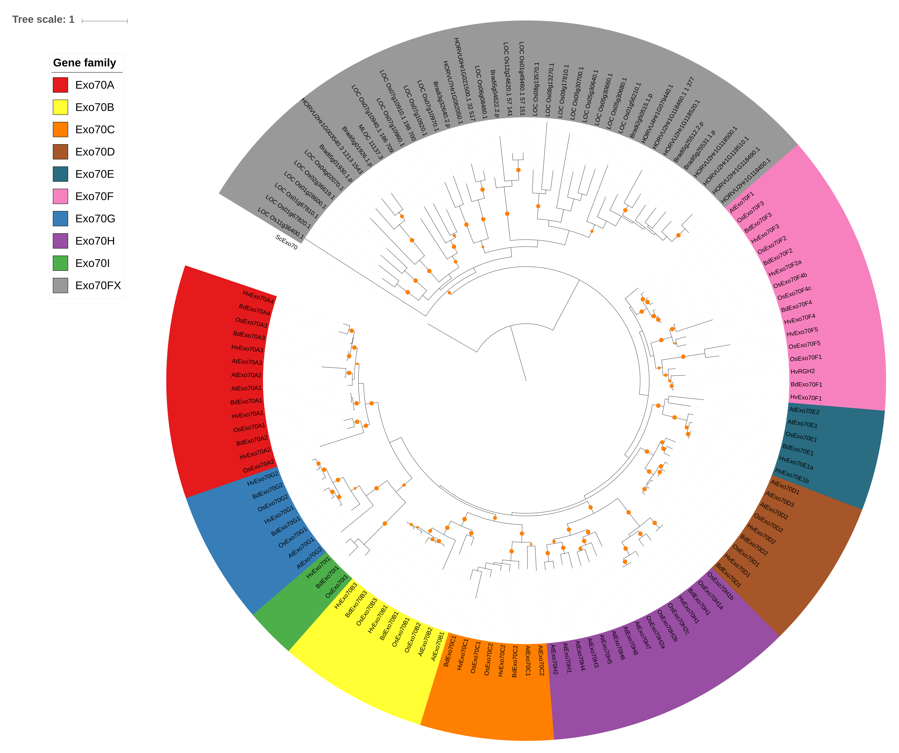

# Analysis of Exo70 gene family and NLR-Exo70

## Table of contents
   * [Analysis of Exo70 gene family and NLR-Exo70](#analysis-of-exo70-gene-family-and-nlr-exo70)
      * [Introduction](#introduction)
      * [Annotation of Exo70 encoding genes in plants](#annotation-of-exo70-encoding-genes-in-plants)
         * [Exo70 gene family in <em>Hordeum vulgare</em>](#exo70-gene-family-in-hordeum-vulgare)
            * [HvExo70A2 (HORVU2Hr1G123350)](#hvexo70a2-horvu2hr1g123350)
            * [HvExo70B1 (HORVU3Hr1G088110)](#hvexo70b1-horvu3hr1g088110)
            * [HvExo70D2 (HORVU7Hr1G064400)](#hvexo70d2-horvu7hr1g064400)
            * [HvExo70E1 (HORVU3Hr1G073850 and HORVU3Hr1G073910)](#hvexo70e1-horvu3hr1g073850-and-horvu3hr1g073910)
            * [HvExo70F2b (HORVU7Hr1G084990)](#hvexo70f2b-horvu7hr1g084990)
            * [HvExo70F3 (HORVU2Hr1G069050)](#hvexo70f3-horvu2hr1g069050)
            * [HvExo70F5 (HORVU2Hr1G116970)](#hvexo70f5-horvu2hr1g116970)
            * [HvExo70G1 (HORVU6Hr1G021690.1)](#hvexo70g1-horvu6hr1g0216901)
            * [HvExo70H1 (HORVU2Hr1G067350.1)](#hvexo70h1-horvu2hr1g0673501)
         * [Exo70 gene family in other plant species](#exo70-gene-family-in-other-plant-species)
            * [Exo70 gene family in <em>Annas comosus</em> (pineapple)](#exo70-gene-family-in-annas-comosus-pineapple)
            * [Exo70 gene family in <em>Arabidopsis thaliana</em>](#exo70-gene-family-in-arabidopsis-thaliana)
            * [Exo70 gene family in <em>Brachypodium distachyon</em>](#exo70-gene-family-in-brachypodium-distachyon)
            * [Exo70 gene family in <em>Musa acuminata</em> (banana)](#exo70-gene-family-in-musa-acuminata-banana)
            * [Exo70 gene family in <em>Oropetium thomaeum</em>](#exo70-gene-family-in-oropetium-thomaeum)
            * [Exo70 gene family in <em>Oryza sativa</em>](#exo70-gene-family-in-oryza-sativa)
            * [Exo70 gene family in <em>Sorghum bicolor</em>](#exo70-gene-family-in-sorghum-bicolor)
            * [Exo70 gene family in <em>Setaria italica</em>](#exo70-gene-family-in-setaria-italica)
            * [Exo70 gene family in <em>Spirodela polyrhiza</em>](#exo70-gene-family-in-spirodela-polyrhiza)
            * [Exo70 gene family in <em>Zea mays</em>](#exo70-gene-family-in-zea-mays)
         * [Domain characterization](#domain-characterization)
      * [Phylogenetic analysis of the Exo70 gene family](#phylogenetic-analysis-of-the-exo70-gene-family)
         * [Annotation of <em>Brachypodium distachyon</em> and <em>Hordeum vulgare</em> Exo70 proteins based on <em>Arabidopsis thaliana</em> and <em>Oryza sativa</em>](#annotation-of-brachypodium-distachyon-and-hordeum-vulgare-exo70-proteins-based-on-arabidopsis-thaliana-and-oryza-sativa)
         * [Expansion of the phylogenetic tree to include sequenced Poaceae species](#expansion-of-the-phylogenetic-tree-to-include-sequenced-poaceae-species)
         * [Expansion of the phylogenetic tree to include sequenced monocot species](#expansion-of-the-phylogenetic-tree-to-include-sequenced-monocot-species)
         * [Development of a phylogenetic tree for <em>Exo70F</em> gene family](#development-of-a-phylogenetic-tree-for-exo70f-gene-family)
      * [Molecular evolution of <em>Exo70</em> gene families](#molecular-evolution-of-exo70-gene-families)
      * [Evolution of <em>Exo70F1</em> in the Poaceae](#evolution-of-exo70f1-in-the-poaceae)
         * [Objectives, hypotheses, and questions](#objectives-hypotheses-and-questions)
         * [<em>RGH2</em> diversity in Poaceae species](#rgh2-diversity-in-poaceae-species)
         * [Phylogenetic analysis of the <em>Exo70F1</em> gene family](#phylogenetic-analysis-of-the-exo70f1-gene-family)
      * [Evolution of <em>RGH1</em>, <em>RGH2</em>, <em>RGH3</em>, and <em>Exo70F1</em> in the Poales](#evolution-of-rgh1-rgh2-rgh3-and-exo70f1-in-the-poales)
         * [Phylogenetic analysis of the <em>RGH1</em> (<em>Mla</em>) gene family](#phylogenetic-analysis-of-the-rgh1-mla-gene-family)
         * [Phylogenetic analysis of the <em>RGH2</em> gene family](#phylogenetic-analysis-of-the-rgh2-gene-family)
         * [Phylogenetic analysis of the <em>RGH3</em> gene family](#phylogenetic-analysis-of-the-rgh3-gene-family)
         * [Phylogenetic analysis of the <em>Exo70F1</em> gene family with <em>RGH2</em> integrations](#phylogenetic-analysis-of-the-exo70f1-gene-family-with-rgh2-integrations)
            * [Generation of Poales <em>Exo70F1</em> phylogenetic tree](#generation-of-poales-exo70f1-phylogenetic-tree)
            * [Differentiating between orthologs and paralogs in the Poales <em>Exo70F1</em> phylogenetic tree](#differentiating-between-orthologs-and-paralogs-in-the-poales-exo70f1-phylogenetic-tree)
            * [<em>Exo70F1</em> phylogenetic tree with integrated domains](#exo70f1-phylogenetic-tree-with-integrated-domains)
      * [Versions of genomes/transcriptomes](#versions-of-genomestranscriptomes)

## Introduction
We describe the annotation of the Exo70 gene family from barley and integrate the identified genes within existing resources from *Brachypodium distachyon*, *Oryza sativa*, and *Arabidopsis thaliana*. We later expand this analysis to include a diverse array of grass species. Using resequencing data from a diverse panel of accessions in *Hordeum vulgare* and *Brachypodium distachyon*, we assess nucleotide diversity and presence/absence variation in the Exo70 gene family. Next, we assess tissue-dependent gene expression in *Hordeum vulgare* for the Exo70 gene families and associate with existing knowledge in *Arabidopsis thaliana*. Lastly, we analyze the integration of Exo70 into nucleotide binding, leucine-rich repeat (NB-LRR or NLR) proteins, focusing on its evolutionary relationship with NLRs, date the integration event, and assess its presence/absence across a range of grass species.

## Annotation of Exo70 encoding genes in plants
Previously, Cvrckova *et al.* (2012) comprehensively described members of the exocyst complex throughout land plants. These species included:
* *Arabidopsis thaliana*
* *Arabidopsis lyrata*
* *Populus trichocarpa*
* *Vitis vinifera*
* *Solanum lycopersicum*
* *Oryza sativa*
* *Sorghum bicolor*
* *Brachypodium distachyon*
* *Selaginella moellendorffii*
* *Physcomitrella patens*

Since the publication of Cvrckova *et al.* (2012), several species have been sequenced and improvements in annotation have increased or altered exocyst complex genes. We set out to identify the Exo70 gene family complement of the newly sequenced *Hordeum vulgare* (barley) and *Oropetium thomaeum* genomes and assign identifiers based on its phylogenetic relationship with *Brachypodium distachyon* and *Oryza sativa*.

### Exo70 gene family in *Hordeum vulgare*
During the course of this analysis, two different genome annotations of barley were used. Initially, the annotation from the IBGSC (2012) *Nature* paper identified 35 proteins containing an Exo70 domain (Pfam PF03081). Later, the annotation from the Mascher *et al.* (2017) *Nature* identified 33 proteins containing an Exo70 domain. Multiple sequence alignment of the protein sequence from the 2012 and 2017 genomes found that the majority of genes were present in both annotations, with the exception of of MLOC_11137.3, MLOC_22709.1, and MLOC_45983.4 in the 2012 annotation and HORVU2Hr1G118460.1, HORVU2Hr1G118490.1 in the 2017 annotation.

**Table 1.** Inconsistent gene models between barley genome annotations from 2012 and 2017.

|Gene              |Issue                     |Reason                                               |
|:-----------------|:-------------------------|:----------------------------------------------------|
|MLOC_11137.3      |Missing in 2017 annotation|Present in genome sequence (2012), contig_1560470    |
|MLOC_22709.1      |Missing in 2017 annotation|Truncated gene model, part of HORVU5Hr1G040140.3     |
|MLOC_45983.4      |Missing in 2017 annotation|Present in genome sequence (2012), contig_283847     |
|HORVU2Hr1G118460.1|Missing in 2012 annotation|Present in genome sequence (2012), missed previously?|
|HORVU2Hr1G118490.1|Missing in 2012 annotation|Present in genome sequence (2012), missed previously?|

MLOC_45983.4 encodes a truncated Exo70 domain, whereas MLOC_11137.3 is present in the 2017 annotation of the barley genome, although as an alternative gene model from the reference set (HORVU3Hr1G094660). Two genes in barley, HORVU5Hr1G039240.1 and HORVU7Hr1G082050.1, had substantial missing data for the open reading frame due to ambiguous bases within the gene model.

**Table 2.** Gene models requiring the removal of N-terminal sequence before the start Met.

|Gene model        |
|------------------|
|HORVU0Hr1G021500.1|
|HORVU1Hr1G070390.1|
|HORVU2Hr1G116970.2|
|HORVU2Hr1G118450.1|
|HORVU2Hr1G118510.1|
|HORVU2Hr1G118520.1|
|HORVU2Hr1G123320.1|
|HORVU3Hr1G094570.3|
|HORVU4Hr1G079440.1|
|HORVU5Hr1G062200.3|
|HORVU6Hr1G021690.1|
|HORVU7Hr1G030080.3|
|HORVU7Hr1G084990.1|

A number of gene models were found to be incorrect. This was either due to the incorrect selection of a representative gene model, or due to mistakes in genome assembly and annotation. Manual curation was performed and the details are described below.

#### HvExo70A2 (HORVU2Hr1G123350)
The gene model proposed for HORVU2Hr1G123350 (HORVU2Hr1G123350.18) was inaccurate due to no Met start and limited sequence from the first available Met, whereas HORVU2Hr1G123350.22 appears to have an intact Met. Subsequent comparison of orthologs from rice and *B. distachyon* and *de novo* transcriptome assemblies of barley found that all annotated gene models from barley were truncated. Comparison of the 2017 pseudomolecules 2017 to 2012 whole genome contig (morex_contig_43759) found a discrepency the 2017 genome that is clearly an artifact (see figure below). A manually curated sequence was created for this gene (HORVU2Hr1G123350.m1).


Three genes (HORVU1Hr1G070390.1, HORVU5Hr1G039240.1, and HORVU7Hr1G082050.1) were found to ambigugous amino acid sequence (*i.e.* X), some of which have reasonably long stretches. These were retained. The final set of barley Exo70 includes 34 proteins (33 from 2017, 1 from 2012) with an additional sequence derived from the transcriptome of Baronesse (*RGH2*).

#### HvExo70B1 (HORVU3Hr1G088110)
The representative gene model selected for HORVU3Hr1G088110 was changed to HORVU3Hr1G088110.3 (equivalent to MLOC_3646.1)

#### HvExo70D2 (HORVU7Hr1G064400)
The representative gene model selected for HORVU7Hr1G064400 was changed to MLOC_19124.1.

#### HvExo70E1 (HORVU3Hr1G073850 and HORVU3Hr1G073910)
A recent duplication at the HvExo70E1 locus generated two near-identical copies of this gene. Confirm mapping with RNAseq data (ongoing).

#### HvExo70F2b (HORVU7Hr1G084990)
This gene was removed from the Exo70 gene family analysis, as it appears to be a truncated version of HvExo70F2.

#### HvExo70F3 (HORVU2Hr1G069050)
The representative gene model selected for HORVU2Hr1G069050 was changed to MLOC_59065.1.

#### HvExo70F5 (HORVU2Hr1G116970)
Correct based on comparative genomics with *Setaria italica*.

#### HvExo70G1 (HORVU6Hr1G021690.1)
Review reference genome with aligned RNAseq reads.

#### HvExo70H1 (HORVU2Hr1G067350.1)
The representative gene model selected for HORVU2Hr1G067350.1 was changed to MLOC_56456.1.

### Exo70 gene family in other plant species
To understand the expansion and evolution of Exo70 gene families in the monocots (such as the grass-specific *Exo70FX*), we identified additional sequenced monocot species on Phytozome from the Department of Energy-Joint Genome Institute.

#### Exo70 gene family in *Annas comosus* (pineapple)
In total, 14 proteins with Exo70 domains were extracted from the *Annas comosus* genome version 321_v3 from the Department of Energy-Joint Genome Institute. 

#### Exo70 gene family in *Arabidopsis thaliana*
In total, 23 proteins with Exo70 domains were extracted from the *Arabidopsis thaliana* genome version 10 from TAIR.

#### Exo70 gene family in *Brachypodium distachyon*
In total, 29 representative proteins with Exo70 domains were extracted from the *Brachypodium distachyon* genome version 3.1 from the Department of Energy-Joint Genome Institute. 

#### Exo70 gene family in *Musa acuminata* (banana)
In total, 28 proteins with Exo70 domains were extracted from the *Musa acuminata* genome version 304_v1 from the Department of Energy-Joint Genome Institute. 

#### Exo70 gene family in *Oropetium thomaeum*
In total, 34 representative proteins with Exo70 domains were extracted from the *Oropetium thomaeum* genome version 1.0 from the Department of Energy-Joint Genome Institute.

#### Exo70 gene family in *Oryza sativa*
In total, 61 representative proteins with Exo70 domains were extracted from the *Oryza sativa* genome version 7 from Michigan State University Rice Genome Annotation Project. 

#### Exo70 gene family in *Sorghum bicolor*
In total, 46 proteins with Exo70 domains were extracted from the *Sorghum bicolor* genome version 454_v2.2 from the Department of Energy-Joint Genome Institute. 

#### Exo70 gene family in *Setaria italica*
In total, 54 proteins with Exo70 domains were extracted from the *Setaria italica* genome version 312_v2.2 from the Department of Energy-Joint Genome Institute. 

#### Exo70 gene family in *Spirodela polyrhiza*
In total, 18 proteins with Exo70 domains were extracted from the *Spirodela polyrhiza* genome version 290_v2 from the Department of Energy-Joint Genome Institute. 

#### Exo70 gene family in *Zea mays*
In total, 47 proteins with Exo70 domains were extracted from the *Zea mays* genome version 284_Ensembl-18_2010-01 from the Department of Energy-Joint Genome Institute. 

Two novel fusions exist with Exo70 proteins in *Zea mays* including GRMZM2G370741_P01 with an aspartic peptidase and GRMZM2G390691_P01 with a hydroxymethylglutaryl-CoA reductase, class I/II protein. Due to the limited contribution of the Exo70 to GRMZM2G370741_P01, this sequence was removed from the analysis. GRMZM2G390691_P01 was reduced to the Exo70 domain alone.

*ZmExo70A1* has an incorrect gene model, spanning two genes GRMZM2G046590_P01 and GRMZM2G074530_P01. A full length cDNA was identified and used (NM_001196530.1).

### Domain characterization
InterProScan was used to assess all putative Exo70 domain containing proteins to define the Exo70 domain region and additional domains associated with Exo70 domains. To assess the domain architecture of Exo70 proteins, we used the [QKdomain](https://github.com/matthewmoscou/QKdomain) (v1.0) suite of scripts to identify the diversity of domains. 

```bash
./interproscan.sh  --output-dir . --input Exo70_species_Ac.fa --iprlookup --seqtype p
./interproscan.sh  --output-dir . --input Exo70_species_At.fa --iprlookup --seqtype p
./interproscan.sh  --output-dir . --input Exo70_species_Bd.fa --iprlookup --seqtype p
./interproscan.sh  --output-dir . --input Exo70_species_Hv.fa --iprlookup --seqtype p
./interproscan.sh  --output-dir . --input Exo70_species_Hv_RGH2.fa --iprlookup --seqtype p
./interproscan.sh  --output-dir . --input Exo70_species_Ma.fa --iprlookup --seqtype p
./interproscan.sh  --output-dir . --input Exo70_species_Os.fa --iprlookup --seqtype p
./interproscan.sh  --output-dir . --input Exo70_species_Ot.fa --iprlookup --seqtype p
./interproscan.sh  --output-dir . --input Exo70_species_Sb.fa --iprlookup --seqtype p
./interproscan.sh  --output-dir . --input Exo70_species_Sc.fa --iprlookup --seqtype p
./interproscan.sh  --output-dir . --input Exo70_species_Si.fa --iprlookup --seqtype p
./interproscan.sh  --output-dir . --input Exo70_species_Sp.fa --iprlookup --seqtype p
./interproscan.sh  --output-dir . --input Exo70_species_Zm.fa --iprlookup --seqtype p

cat *.fa > Exo70_species_all.fa
cat *.tsv > Exo70_species_all.fa.tsv
```

```bash
python QKdomain_preprocess.py Exo70_species_all.fa.tsv Exo70_species_all_preprocess_summary.txt ../../Exo70_abbreviations.txt
```

**Table 3.** Protein domains associated with the Exo70 gene family in all species studied.

|Domain identifier|Software       |Domain type                                        |Genes with domain|Total observed domains|Average domain length|Abbreviation|
|:---------------:|:-------------:|:--------------------------------------------------|:---------------:|:--------------------:|:-------------------:|:----------:|
|SSF74788          |SUPERFAMILY|Cullin repeat-like-containing domain|353|564|274.1241135|Exo70|
|PF03081           |Pfam|Exocyst complex component Exo70|354|375|298.4506667|Exo70|
|Coil              |Coils||67|72|18.25|CC|
|TMhelix           |TMHMM||10|24|22.58333333|TM|
|G3DSA:3.40.50.620 |Gene3D|Rossmann-like alpha/beta/alpha sandwich fold|7|7|111.4285714|tRNAligase|
|G3DSA:2.40.70.10  |Gene3D|Aspartic peptidase domain|4|6|100.1666667|AspPEP|
|SSF52402          |SUPERFAMILY|NB-ARC|6|6|109|NB|
|PR00449           |PRINTS||1|5|19.8|GTPase|
|PF14541           |Pfam|Xylanase inhibitor, C-terminal|4|4|97.5|XI|
|PF07779           |Pfam|Cas1p 10 TM acyl transferase domain|4|4|133|Cas1p|
|SM00248           |SMART|Ankyrin repeat|1|4|30.5|Ank|
|PF03087           |Pfam|Protein of unknown function DUF241, plant|1|4|203.25|DUF241|
|G3DSA:1.10.357.10 |Gene3D|Tetracycline transcriptional regulator, TetR-like, C-terminal|3|3|111|TetR|
|SSF52540          |SUPERFAMILY|P-loop containing nucleoside triphosphate hydrolase|3|3|212.3333333|NTPase|
|G3DSA:3.40.50.300 |Gene3D|P-loop containing nucleoside triphosphate hydrolase|3|3|154|NTPase|
|PF00931           |Pfam|NB-ARC|2|3|192.3333333|NB|
|cd01989           |CDD|N-terminal Ser/Thr Kinase|3|3|164|Pkinase|
|SSF50630          |SUPERFAMILY|Aspartic peptidase domain|3|3|187.6666667|AspPEP|
|G3DSA:3.80.10.10  |Gene3D|Leucine-rich repeat domain, L domain-like|2|3|131.3333333|LRR|
|PS51767           |ProSiteProfiles|Peptidase family A1 domain|2|2|361|Ank|
|SSF56542          |SUPERFAMILY|Hydroxymethylglutaryl-CoA reductase, class I/II, substrate-binding domain|1|2|65.5|CoAreductase|
|G3DSA:1.25.40.20  |Gene3D|Ankyrin repeat-containing domain|1|2|102.5|Ank|
|PF14543           |Pfam|Xylanase inhibitor, N-terminal|2|2|79|XI|
|PF00368           |Pfam|Hydroxymethylglutaryl-CoA reductase, class I/II|1|2|84.5|CoAreductase|
|SSF52047          |SUPERFAMILY|Leucine-rich repeat domain, L domain-like|1|2|136.5|LRR|
|SSF53756          |SUPERFAMILY|UGP|2|2|60|UGP|
|PR00071           |PRINTS|Hydroxymethylglutaryl-CoA reductase, class I/II|1|2|21.5|CoAreductase|
|PF12796           |Pfam|Ankyrin repeat-containing domain|1|1|56|Ank|
|cd00204           |CDD|Ankyrin repeat|1|1|167|Ank|
|SSF52058          |SUPERFAMILY|Leucine-rich repeat domain, L domain-like|1|1|317|LRR|
|cd00009           |CDD|P-loop containing nucleoside triphosphate hydrolase|1|1|87|NTPase|
|G3DSA:3.30.70.420 |Gene3D|Hydroxymethylglutaryl-CoA reductase, class I/II, NAD/NADP-binding domain|1|1|63|CoAreductase|
|PS50065           |ProSiteProfiles|Hydroxymethylglutaryl-CoA reductase, class I/II|1|1|267|CoAreductase|
|SSF55035          |SUPERFAMILY|Hydroxymethylglutaryl-CoA reductase, class I/II, NAD/NADP-binding domain|1|1|72|CoAreductase|
|PS50077           |ProSiteProfiles|HEAT, type 2|1|1|40|HEAT|
|PF02309           |Pfam|AUX/IAA domain|1|1|72|AUX|
|TIGR00231         |TIGRFAM|Small GTP-binding protein domain|1|1|145|GTPase|
|PF05633           |Pfam|Protein BYPASS-related|1|1|244|DUF793|
|PF00071           |Pfam|Small GTPase superfamily|1|1|152|GTPase|
|SM00175           |SMART|Small GTPase superfamily|1|1|157|GTPase|
|SM00174           |SMART|Small GTPase superfamily|1|1|155|GTPase|
|G3DSA:3.90.770.10 |Gene3D|Hydroxymethylglutaryl-CoA reductase, class I/II, catalytic domain|1|1|112|CoAreductase|
|PF05699           |Pfam|HAT, C-terminal dimerisation domain|1|1|78|HAT|
|G3DSA:3.30.420.10 |Gene3D|Ribonuclease H-like domain|1|1|113|RiboH|
|PS51419           |ProSiteProfiles||1|1|186|GTPase|
|SSF53098          |SUPERFAMILY|Ribonuclease H-like domain|1|1|112|RiboH|
|PF13962           |Pfam|PGG domain|1|1|107|PGG|
|PF01612           |Pfam|3'-5' exonuclease domain|1|1|104|ExoI|
|SM00173           |SMART|Small GTPase superfamily|1|1|159|GTPase|
|SSF46565          |SUPERFAMILY|DnaJ domain|1|1|78|DnaJ|
|PF13637           |Pfam||1|1|54|Ank|
|G3DSA:1.10.287.110|Gene3D|DnaJ domain|1|1|57|DnaJ|
|SSF48403          |SUPERFAMILY|Ankyrin repeat-containing domain|1|1|172|Ank|
|PS50297           |ProSiteProfiles|Ankyrin repeat-containing domain|1|1|171|Ank|
|PF06507           |Pfam|Auxin response factor|1|1|66|AUX|
|PS50088           |ProSiteProfiles|Ankyrin repeat|1|1|24|Ank|

Coils and TMHMM predict the presence of coiled coils and transmembrane domains, respectively. The presence of these predicted domains is not surprising, as a coiled coil is a secondary structure and transmembrane domain prediction could be associated with hydrophobic residues in Exo70 proteins that interact with the membrane. It is unclear what the role of the domains Rossmann-like alpha/beta/alpha sandwich fold (associated with tRNA ligase) and aspartic peptidase, which will require further study. Of particular interest was the association of NB and LRR domains. It is known that Exo70 genes integrate into NB and NB-LRR genes. Next, we evaluated the protein domain structure using `QKdomain_process.py` with default parameters to identify proteins with non-Exo70 domains.

```bash
python QKdomain_process.py -d Exo70 Exo70_v3_all.fa Exo70_v3_all.fa.tsv Exo70_abbreviations.txt Exo70_v3_all_process_summary.txt Exo70_v3_all_Exo70.fa
```

**Table 4.** Domain architecture of genes containing a nucleotide binding (NB) domain.

|Gene                     |Domain architecture         |
|:------------------------|:--------------------------:|
|LOC_Os07g10910.1         |    Ser/Thr kinase-Exo70    |
|LOC_Os07g10910.2         |    Ser/Thr kinase-Exo70    |
|LOC_Os07g10940.1         |    Ser/Thr kinase-Exo70    |
|MLOC_11137.3             |       ATPase-Exo70         |
|HORVU2Hr1G003540.3       |       NB-LRR-Exo70         |
|HvRGH2                   |       NB-LRR-Exo70         |
|GRMZM2G436742_P01        |hAT-Ser/Thr kinase-CC-Exo70 |
|Seita.5G432200.1.p       |    Ser/Thr kinase-Exo70    |

The Ser/Thr kinase domain exhibited in LOC_Os07g10910 (two alternate gene models), LOC_Os07g10940, GRMZM2G436742_P01, and Seita.5G432200.1.p, as well as the ATPase domain in MLOC_11137.3 were removed from these sequences for subsequent analyses. HORVU2Hr1G003540.3 is a NB-LRR with an integrated Exo70, similar to others that have been observed. The identifier for HORVU2Hr1G003540.3 in the [barleyNLRome](https://github.com/matthewmoscou/barleyNLRome) analysis is 2097|m.19808. The implication of Exo70 integration in NB-LRRs will be discussed in more detail below, although for this analysis this NB-LRR regions were removed for analysis. 

## Phylogenetic analysis of the Exo70 gene family
### Annotation of *Brachypodium distachyon* and *Hordeum vulgare* Exo70 proteins based on *Arabidopsis thaliana* and *Oryza sativa*
To generate a phylogenetic tree of the Exo70 gene family, we aligned the full length Exo70 proteins, except for genes listed in **Table 4**, where the Exo70 domain region was extracted from the gene based on the `QKdomain` output. A single gene model was selected at each gene locus for the analysis. Multiple sequence alignment using MUSCLE was performed on the [134 Exo70 genes](data/alignments/Exo70_AtBdHvOsSc.fa). The *Saccharomyces cerevisiae* Exo70 gene (YJL085W) was included as an outgroup in phylogenetic analysis.

```bash
cat Exo70_species_At_curated.fa Exo70_species_Bd_curated.fa Exo70_species_Hv_Met_curated.fa Exo70_species_Hv_RGH2_curated.fa Exo70_species_Os_curated.fa Exo70_species_Sc_curated.fa > Exo70_AtBdHvOsSc.fa
muscle -in Exo70_AtBdHvOsSc.fa -out Exo70_AtBdHvOsSc_MUSCLE.aln -clwstrict
```

The [multiple sequence alignment](data/alignments/Exo70_AtBdHvOsSc_MUSCLE.aln) included 134 proteins with a length of 1,183 aa. `QKphylogeny_alignment_analysis.py` was used to reduce the alignment to sites with at least 40% of proteins with a amino acid (non-gaps in alignment) and only included proteins with at least 40% coverage over the alignment from start to stop. This reduced the alignment to 130 proteins and alignment length of 620 aa. The maximum likelihood phylogenetic tree was constructed using RAxML with the JTT amino acid substitution model, with 1,000 bootstraps performed in parallel.

```bash
python QKphylogeny_alignment_analysis.py -a Exo70_AtBdHvOsSc_MUSCLE.phy -b 0.4 -d 0.4 -o Exo70_AtBdHvOsSc_MUSCLE_b0.4_d0.4.phy -t protein
raxml -f a -x 943789321641 -p 47823147231 -# 1000 -m PROTGAMMAAUTO -s Exo70_AtBdHvOsSc_MUSCLE_b0.4_d0.4.phy -n Exo70_AtBdHvOsSc -T 4
```

The phylogenetic tree was visualized using [EMBL iTOL](http://itol.embl.de) as shown below. The phylogenetic tree was rooted based on ScExo70. Topological features of individual Exo70 protein families were added based on prior knowledge from *Arabidopsis thaliana* and *Oryza sativa*, and bootstrap support within the phylogenetic tree using the iTOL [TREE_COLORs](data/phylogeny/Exo70_AtBdHvOsSc/iTOL_colors_style_Exo70_AtBdHvOsSc.txt). 



### Expansion of the phylogenetic tree to include sequenced Poaceae species
The inclusion of *Arabidopsis thaliana* in the phylogenetic tree facilitated the classification of Exo70 proteins based on preexisting annotations. Next, we extended the phylogenetic tree of full length Exo70 proteins to include other grass species including *Oropetium thomaeum*, *Sorghum bicolor*, *Setaria italica*, and *Zea mays*, except for proteins listed in **Table 4**, where the Exo70 domain region was extracted from the gene based on the `QKdomain` output. A single gene model was selected at each gene locus for the analysis. Multiple sequence alignment using MUSCLE was performed on the [257 Exo70 genes](data/alignments/Exo70_BdHvOsOtSbScSiZm.fa). The *Saccharomyces cerevisiae* Exo70 gene (YJL085W) was included as an outgroup in phylogenetic analysis.

Gene identifers were converted into human readable format using `QKphylogeny_rename_nodes.py` based on the annotation from [Cvrčková *et al.* (2012) *Frontiers in Plant Science*](https://doi.org/10.3389/fpls.2012.00159). 

```bash
python QKphylogeny_rename_nodes.py -t RAxML_bipartitionsBranchLabels.Exo70_AtBdHvOsSc -l ~/Research/projects/Exo70/data/Exo70_gene_definitions.txt -o RAxML_bipartitionsBranchLabels.Exo70_AtBdHvOsSc_defined
```

```bash
cat Exo70_species_Bd_curated.fa Exo70_species_Hv_Met_curated.fa Exo70_species_Hv_RGH2_curated.fa Exo70_species_Os_curated.fa Exo70_species_Ot_curated.fa Exo70_species_Sb_curated.fa Exo70_species_Sc_curated.fa Exo70_species_Si_curated.fa Exo70_species_Zm_curated.fa > Exo70_BdHvOsOtSbScSiZm.fa
muscle -in Exo70_BdHvOsOtSbScSiZm.fa -out Exo70_BdHvOsOtSbScSiZm_MUSCLE.aln -clwstrict
python QKphylogeny_alignment_analysis.py -a Exo70_BdHvOsOtSbScSiZm_MUSCLE.phy -b 0.4 -d 0.4 -o Exo70_BdHvOsOtSbScSiZm_MUSCLE_b0.4_d0.4.phy -t protein
```

The [multiple sequence alignment](data/alignments/Exo70_BdHvOsOtSbSiZm_MUSCLE.aln) had a length of 2,254 aa. `QKphylogeny_alignment_analysis.py` was used to reduce the alignment to sites with at least 40% of proteins with a amino acid (non-gaps in alignment) and only included proteins with at least 40% coverage over the alignment from start to stop. This reduced the alignment to 256 proteins and alignment length of 604 aa. The maximum likelihood phylogenetic tree was constructed using RAxML with the JTT amino acid substitution model, with 1,000 bootstraps performed in parallel.

```bash
raxml -f a -x 4738219462314 -p 4758901234541 -# 1000 -m PROTGAMMAAUTO -s Exo70_BdHvOsOtSbScSiZm_MUSCLE_b0.4_d0.4.phy -n Exo70_BdHvOsOtSbScSiZm -T 4
```

All analyses can be found in the folder `data\phylogeny\Exo70_BdHvOsOtSbScSiZm`. Next, we extract the node labels from the phylogenetic tree.

```bash
python QKphylogeny_rename_nodes.py -t RAxML_bipartitionsBranchLabels.Exo70_BdHvOsOtSbScSiZm -l ~/Research/projects/Exo70/data/Exo70_gene_definitions.txt -o RAxML_bipartitionsBranchLabels.Exo70_BdHvOsOtSbScSiZm_defined
```

As above, iTOL was used for visualization and the phylogenetic tree was rooted based on ScExo70. Topological features of individual Exo70 protein families were added based on prior knowledge from *Arabidopsis thaliana* and *Oryza sativa*, and bootstrap support within the phylogenetic tree using the iTOL [TREE_COLORs](data/phylogeny/Exo70_BdHvOsOtSbScSiZm/iTOL_colors_style_Exo70_BdHvOsOtSbScSiZm.txt). 


### Expansion of the phylogenetic tree to include sequenced monocot species
Next, we applied the same analysis to characterized all sequenced monocot species.

```bash
cat Exo70_species_Ac_curated.fa Exo70_species_Bd_curated.fa Exo70_species_Hv_Met_curated.fa Exo70_species_Hv_RGH2_curated.fa Exo70_species_Ma_curated.fa Exo70_species_Os_curated.fa Exo70_species_Ot_curated.fa Exo70_species_Sb_curated.fa Exo70_species_Sc_curated.fa Exo70_species_Si_curated.fa Exo70_species_Sp_curated.fa Exo70_species_Zm_curated.fa > ../../alignments/Exo70_AcBdHvMaOsOtSbScSiSpZm.fa
muscle -in Exo70_AcBdHvMaOsOtSbScSiSpZm.fa -out Exo70_AcBdHvMaOsOtSbScSiSpZm_MUSCLE.aln -clwstrict
python QKphylogeny_alignment_analysis.py -a Exo70_AcBdHvMaOsOtSbScSiSpZm_MUSCLE.phy -b 0.4 -d 0.4 -o Exo70_AcBdHvMaOsOtSbScSiSpZm_MUSCLE_b0.4_d0.4.phy -t protein
raxml -f a -x 9342734902141 -p 3246823914 -# 1000 -m PROTGAMMAAUTO -s Exo70_AcBdHvMaOsOtSbScSiSpZm_MUSCLE.phy -n Exo70_AcBdHvMaOsOtSbScSiSpZm -T 4
```

The [multiple sequence alignment](data/alignments/Exo70_AcBdHvMaOsOtSbScSiSpZm_MUSCLE.aln) included 316 proteins and had a length of 2,318 aa. `QKphylogeny_alignment_analysis.py` was used to reduce the alignment to sites with at least 40% of proteins with a amino acid (non-gaps in alignment) and only included proteins with at least 40% coverage over the alignment from start to stop. This reduced the alignment to 310 proteins and alignment length of 624 aa. The maximum likelihood phylogenetic tree was constructed using RAxML with the AUTO amino acid substitution model (which selected JTT), with 1,000 bootstraps performed in parallel. As above, iTOL was used for visualization and the phylogenetic tree was rooted based on ScExo70. Topological features of individual Exo70 protein families were added based on prior knowledge from *Arabidopsis thaliana* and *Oryza sativa*, and bootstrap support within the phylogenetic tree using the iTOL [TREE_COLORs](data/phylogeny/Exo70_AcBdHvMaOsOtSbScSiSpZm/iTOL_colors_style_Exo70_AcBdHvMaOsOtSbScSiSpZm.txt). 


### Development of a phylogenetic tree for *Exo70F* gene family
The integrated Exo70 domain of RGH2 was found to reside within the Exo70F1 clade. We next develop a Exo70F phylogenetic tree to visualize the relationship of Exo70F proteins.

```bash
muscle -in Exo70_AtBdHvOsOtSbSiZm_Exo70F.fa -out Exo70_AtBdHvOsOtSbSiZm_Exo70F_MUSCLE.aln -clwstrict
python QKphylogeny_alignment_analysis.py -a Exo70_AtBdHvOsOtSbSiZm_Exo70F_MUSCLE.phy -b 0.4 -d 0.4 -o Exo70_AtBdHvOsOtSbSiZm_Exo70F_MUSCLE_b0.4_d0.4.phy -t protein
raxml -f a -x 78453201957413 -p 9758494154143 -# 1000 -m PROTGAMMAAUTO -s Exo70_AtBdHvOsOtSbSiZm_Exo70F_MUSCLE_b0.4_d0.4.phy -n Exo70_AtBdHvOsOtSbSiZm_Exo70F -T 4
```

## Molecular evolution of *Exo70* gene families
The identification of orthologous groups facilitated molecular evolutionary analyses of individual gene families, with the main goal of identifying dN/dS values. Our first step was to extract the coding sequence for all Poaceae Exo70 genes (although excluding the Exo70FX gene family).

```bash
python QKutilities_fasta_subset.py -s Exo70_gene_definitions.txt -f ~/Research/sequences/barley_gDNA_2017/160517_Hv_IBSC_PGSB_r1_CDS_AllConf_REPR_annotation.fasta -o HvExo70_CDS.fa
python QKutilities_fasta_subset.py -s Exo70_gene_definitions.txt -f ~/Research/sequences/brachypodium_3.1/annotation/Bdistachyon_314_v3.1.cds.fa -o BdExo70_CDS.fa
python QKutilities_fasta_subset.py -s Exo70_gene_definitions.txt -f ~/Research/sequences/oryza_sativa/Oryza_sativa.MSU7.cds.all.fa -o OsExo70_CDS.fa
python QKutilities_fasta_subset.py -s Exo70_gene_definitions.txt -f ~/Research/sequences/grasses/genome/Othomaeum_386_v1.0.cds.fa -o OtExo70_CDS.fa
python QKutilities_fasta_subset.py -s Exo70_gene_definitions.txt -f ~/Research/sequences/grasses/genome/Sbicolor_454_v3.1.1.cds.fa -o SbExo70_CDS.fa
python QKutilities_fasta_subset.py -s Exo70_gene_definitions.txt -f ~/Research/sequences/grasses/genome/Sitalica_312_v2.2.cds.fa -o SiExo70_CDS.fa
python QKutilities_fasta_subset.py -s Exo70_gene_definitions.txt -f ~/Research/sequences/grasses/genome/Zmays_284_Ensembl-18_2010-01-MaizeSequence.cds.fa -o ZmExo70_CDS.fa
```

Next, a Python wrapper script was generated that performs the following operations:
* Imports gene family membership
* Imports coding sequence
* Generates gene family-specific FASTA files
* Performs translation-based multiple sequence alignment using PRANK
* Develops a maximum likelihood phylogenetic tree using RAxML
* Estimates dN/dS values using PAML codeml

The script is [Exo70_systematic_analysis.py](data/codeml/systematic_analysis/Exo70_systematic_analysis.py)

## Evolution of *Exo70F1* in the Poaceae
The following analysis is associated with the manuscript entitled 'An ancient integration at *Mla* is maintained as a *trans*-species polymorphism'. We observed that *RGH2* in the cv. Baronesse has a C-terminal integration of *Exo70F1*. Allelic variants in barley of *RGH2* exist that are either NB-LRR or NB-LRR-Exo70F1. The integration spans approximately 86.9% of Exo70F1 and lacks only the first 86 aa. This prompted several initial questions including:
 * Does allelic variation exist outside *Hordeum vulgare*?
 * When did the integration of the *Exo70F* into *RGH2* occur?

### Objectives, hypotheses, and questions
Experimental approaches:
* dN / dS ratio can be used to assess the variation in non-synonymous and synonymous sites between allelic variants of RGH2-Exo70 in barley and the wheat homolog.
* Assess the non-synonymous and synonymous sites between allelic variants of RGH2-Exo70 in barley without an Exo70 integration.
* Is the origin of the *Exo70F* integrated domain under positive or purifying selection? Within *Hordeum vulgare* and compared to *Brachypodium distachyon* and *Oryza sativa*.

**Question:** Is the integrated Exo70F a functional Exo70? (Functional, non-functional (decoy), subfunctionalization, or neofunctionalization)
* Alternative hypothesis: The integration of Exo70F simply provide specific localization of *RGH2* for immune signalling.

Knowledge required for developing experimental approaches:
* Gene expression of *Exo70F* genes to ascertain tissue specificity and potential biological role.

Experimental approaches:
* Recreate the original protein through fusion of the missing N-terminal sequence with its origin (in parallel with native promoter and terminator).
* Design an approach to complement a deficient knockout of the origin of the integrated *Exo70F*.
* Perform yeast 2-hybrid assays that demonstrate the ability to bind exocyst components, similar to the origin.
* Show similar localization patterns of the origin and integrated *Exo70F*.

**Question:** Does the *Brachypodium distachyon* homolog of RGH2-Exo70 have allelic variation for integration other than a lectin domain?

**Question:** Is their an *Mla* haplotype that has alternate haplotypes of RGH2 integrated domains other than Exo70?

**Hypothesis:** The *Exo70F* gene family is under strong diversifying selection.
The rationale is that several members of the *Exo70F* gene family are the target of effectors.

Experimental approaches:
* Investigate the number of genes within the *Exo70F* gene family. (Also *Exo70FX*).
* Perform pairwise comparisons among species for every orthologous group to test for diversifying selection.

**Question:** What is the process of integration for *Exo70F*?
* Are there signatures within *RGH2* that permit integration of Exo70?
* Do these signatures exist within integrated alleles but lack in non-integrated alleles?

### *RGH2* diversity in Poaceae species
We set out to identify publically available transcriptome data sets that capture the diversity of other grass species. In our initial screen, we found that 10 accessions of *Aegilops tauschii* that have RNAseq and assembled transcriptomes. These assemblies are described in the following manuscript:
> Nishijima *et al.*, "Genome-wide identification of novel genetic markers from RNA sequencing assembly of diverse *Aegilops tauschii* accessions.", *Mol. Genet. Genomics*, 2016 May 3;291(4):1681-94

**Table 5.** *Aegilops tauschii* accessions, short-read archive (SRA), and transcriptome (TSA) identifiers.

|Accession|   SRA    |      TSA     |
|:-------:|:--------:|:------------:|
|AT76     |DRR058959 |IAAN00000000.1|
|KU-2003  |DRR058960 |IAAO00000000.1|
|KU-2025  |DRR058961 |IAAP00000000.1|
|KU-2075  |DRR058962 |IAAQ00000000.1|
|KU-2078  |DRR058963 |IAAR00000000.1|
|KU-2087  |DRR058964 |IAAS00000000.1|
|KU-2093  |DRR058965 |IAAT00000000.1|
|KU-2124  |DRR058966 |IAAU00000000.1|
|KU-2627  |DRR058967 |IAAV00000000.1|
|PI499262 |DRR058968 |IAAW00000000.1|

Using BLAST, we discovered that *Exo70F1* was highly expressed in all 10 accessions. *RGH2* was identified in three accessions, of which all had an integrated *Exo70F1*. Sequence alignment of the *Hordeum vulgare* and *Aegilops tauschii* *RGH2-Exo70F1* found high sequence identity both at the DNA (88.4%) and protein level (84.1%). Importantly, the integration occured at the same site in both proteins, suggesting they are derived from a common ancestor.

We expanded our search to include a diverse array of Poaceae species, including 14 species. Unfortunately, for the majority of species, only a single accession was sequenced.

**Table 6.** Sequence read archive (SRA) data sets used for *de novo* transcriptome assembly of Poaceae species

|Species                    |Abbreviation|Accession|Type |Identifiers                                                           |Notes              |
|:--------------------------|:----------:|:-------:|:---:|:---------------------------------------------------------------------|:------------------|
|*Achnatherum splendens*    |   *Acs*    |         | RNA |SRR3089957, SRR3089983, SRR3089986                                    |Subset of data used|
|*Aegilops tauschii*        |   *Aet*    |         | RNA |See above table.                                                      |                   |
|*Agropyron cristatum*      |   *Agc*    |         | RNA |SRR3087732                                                            |                   |
|*Agropyron desertorum*     |   *Agd*    |         | RNA |SRR3087737                                                            |                   |
|*Agrostis stolonifera*     |   *Ags*    |         | RNA |SRR5309260, SRR5309261, SRR5309262                                    |Subset of data used|
|*Avena sativa*             |   *Avs*    |Victoria | RNA |1563_LIB18366_LDI15857_CACGAT_L002_R1                                 |                   |
|*Bromus inermis*           |    *Bi*    |         | RNA |SRR3087621                                                            |                   |
|*Dactylis glomerata*       |    *Dg*    |         | RNA |ERR1777661, ERR1777664, ERR1777666                                    |Subset of data used|
|*Festuca pratensis*        |    *Fp*    |         | RNA |SRR3096274, SRR3096275, SRR3096290, SRR3096312, SRR3096315, SRR3096651|Subset of data used|
|*Holcus lanatus*           |    *Hl*    |         | RNA |ERR294007 to ERR294017                                                |Subset of data used|
|*Melica nutans*            |    *Mn*    |         | RNA |ERR1744575 to ERR1744595                                              |                   |
|*Nardus stricta*           |    *Ns*    |         | RNA |ERR1744596 to ERR1744603                                              |                   |
|*Phalaris arundinacea*     |   *Pha*    |         | RNA |ERR1777669 to ERR1777676                                              |Subset of data used|
|*Poa annua*                |   *Poa*    |         | RNA |SRR1633980                                                            |                   |
|*Poa pratensis*            |   *Pop*    |         | RNA |See table below.                                                      |                   |
|*Stipa lagascae*           |    *Sl*    |         | RNA |ERR1744604 to ERR1744610                                              |                   |

First, we need to assess the degree of identity at the nucleotide/protein level of NB-LRR and Exo70 encoding domains within RGH2 and Exo70 genes/proteins.

Alignment of RGH2 (Morex), RGH2 (Baronesse), and RGH2 (*Aegilops tauschii*) found alignment to the following amino acid positions:
* 2312|m.12779 at 975 aa
* RGH2 (Baronesse) at 975 aa
* RGH2 (*Aegilops tauschii*) at 961 aa

**Table 7.** Pairwise nucleotide/protein identity of RGH2 from *Hordeum vulgare* and *Aegilops tauschii*. Upper right is nucleotide identity, lower left is protein identity.

|              |RGH2 Ta|RGH2 Morex|RGH2 Baronesse|
|:-------------|:-----:|:--------:|:------------:|
|RGH2 Ta       |    -  |   91.9   |     92.2     |
|RGH2 Morex    | 89.3  |      -   |     95.3     |
|RGH2 Baronesse| 89.4  |   92.4   |        -     |

**Conclusion:** Greater intraspecific than interspecific identity is observed in RGH2 at the nucleotide and protein level for the NB-LRR encoding region of *RGH2*. This observation does not specifically exclude the hypothesis that the integration preceded speciation, as gene conversion can contribute to higher interspecific gene identity.

Alignment of HvExo70F1 (HORVU3Hr1G094570.3; Morex), Exo70F-ID (RGH2; Baronesse), and Exo70-ID (RGH2; *Aegilops tauschii*) found that alignment starts at the following amino acid positions:
* Exo70F1 (HORVU3Hr1G094570.3; Morex) at 98 aa
* RGH2 (Baronesse) at 1033 aa
* RGH2 (*Aegilops tauschii*) at 1048 aa
* Exo70F1 (*Brachypodium distachyon*) at 98 aa
* Exo70F1 (Os01g69230.1; *Oryza sativa*) at 75 aa

**Table 8.** Pairwise nucleotide/protein identity of Exo70F1 from *Hordeum vulgare*, *Brachypodium distachyon*, and *Oryza sativa* including the *RGH2* region encoding the Exo70 integrated domains from *Hordeum vulgare* and *Aegilops tauschii*. Upper right is nucleotide identity, lower left is protein identity.

|              |OsExo70F1|BdExo70F1|HvExo70F1|RGH2 Ta|RGH2 Baronesse|
|:-------------|:-------:|:-------:|:-------:|:-----:|:------------:|
|OsExo70F1     |     -   |  85.3   |  84.1   |  72.5 |    72.3      |
|BdExo70F1     |  84.3   |     -   |  90.6   |  77.8 |    77.1      |
|HvExo70F1     |  81.5   |  92.0   |     -   |  76.9 |    76.8      |
|RGH2 Ta       |  66.8   |  72.9   |  72.0   |     - |    87.2      |
|RGH2 Baronesse|  65.5   |  70.8   |  70.5   |  79.8 |       -      |

**Conclusion:** Several results can be derived from this dataset:
1. *Exo70F1* from barley and Brachypodium share substantially higher identity at the nucleotide and protein level than with rice *Exo70F1*.
2. The integrated *Exo70F1* in barley and wheat share substantially higher identity at the nucleotide and protein level than with *Exo70F1* from barley, Brachypodium, and rice.

This is a striking result, as it suggests that the integrated Exo70F1 shares the same identity 

### Phylogenetic analysis of the *Exo70F1* gene family
To understand the relationship of the *Exo70F1* gene family, a multiple sequence alignment using PRANK was used for the development of a phylogenetic tree. OsExo70F3 was included to be used as an outgroup to root the tree.
```bash
prank -d=Exo70F1_AtBdHvOs.fa -o=Exo70F1_AtBdHvOs.PRANK.phy -f=phylips -protein
```

Next, RAxML was used to generate the phylogenetic tree. Bootstrap support was generated using 100 bootstraps. Convergence of bootstraps was determined using the `autoMRE` command in RAxML and was met after 250 bootstraps. We use the `-f b` command in RAxML to add the bootstrap values to the phylogenetic tree.
```bash
raxml -s Exo70F1_AtBdHvOs.PRANK.phy -n EXO70F1_MULTIGAMMA -m PROTGAMMAJTT -p 654967019 -T 4
raxml -s Exo70F1_AtBdHvOs.PRANK.phy -n EXO70F1_MULTIGAMMA_bootstrap_r1 -m PROTGAMMAJTT -N 100 -p 5247757188 -T 4
cat RAxML_parsimonyTree.EXO70F1_MULTIGAMMA_bootstrap_r* > allBootstraps
raxml -z allBootstraps -m PROTGAMMAJTT -I autoMRE -n TEST -p 8147553599
raxml -f b -z allBootstraps -t RAxML_result.EXO70F1_MULTIGAMMA -m PROTGAMMAJTT -n EXO70F1_PRANK
```

The resulting tree is shown below. There are three limitations in this analysis:
* We do not have Exo70F1 from *Aegilops tauschii*,
* OsExo70F3 is very diverged from the Exo70F1 gene family, and
* Use of DNA will be more powerful for generating the phylogenetic tree (and useful for other evolutionary analyses).


Next, we expanded the analysis to include the PACMAD clade species *Sorghum bicolor*, *Setaria italica*, and *Zea mays*, and distantly related monocots *Musa acuminata* and *Spirodela polyrhiza*. Exo70 proteins were identified using the Pfam identifier PF03081 and used to performed a multiple sequence alignment using MUSCLE. Manually curation was used to correct the alignment of full length Exo70 proteins, either by extracting the Exo70 domain from NB-LRRs or removal of small fragmented Exo70 proteins (**Table 9**). ScExo70 was added to the alignment as an outgroup.

**Table 9.** Monocot full length Exo70 domain containing proteins that were manually curated.

|Identifier        |Curation comments                       |
|:----------------:|:---------------------------------------|
|HvRGH2            |Extracted Exo70 integrated domain       |
|GRMZM2G447213_P01 |Removed from alignment, truncated domain|
|Seita.9G386900.1.p|Removed from alignment, truncated domain|
|Spipo0G0037600    |Removed from alignment, truncated domain|

```bash
muscle -in Exo70_all_grasses.fa -out Exo70_all_grasses_MUSCLE.aln -clwstrict
raxml -s Exo70_all_grasses.phy -n Exo70_grasses -m PROTGAMMAAUTO -p 47839021462189 -T 6
```

Bootstraps were not performed on the tree, but inference from the *Hordeum vulgare*, *Brachypodium distachyon*, and *Oryza sativa* phylogenetic tree has strong support for a Exo70F1 gene family clade. The topology of the Exo70F1 and species tree are identical, although *Musa acuminata* and *Spirodela polyrhiza* do not have an expansion in the Exo70F family, with each having only single copies of Exo70F. *Zea mays* has an additional copy of Exo70F1.


Exo70F1 from *Setaria italica* was selected as an outgroup for phylogenetic tree construction with the Exo70F1 from *Hordeum vulgare*, *Aegilops tauschii*, *Brachypodium distachyon*, and *Oryza sativa*. Exo70F1 from *Aegilops tauschii* was identified in the *de novo* transcriptome assembly of accession KU2093.

```bash
prank -d=Exo70F1_Si.fa -o=Exo70F1_Si.PRANK.phy -f=phylips -DNA -codon
raxml -s Exo70F1_Si.best.phy -n Exo70F1_Si_outgroup -m GTRCAT -o Seita.5G431300.1 -p 6849563425341 -T 4
raxml -s Exo70F1_Si.best.phy -n Exo70F1_Si_outgroup_bootstrap_r1 -m GTRCAT -o Seita.5G431300.1 -N 100 -p 5247757188 -T 4
cat RAxML_parsimonyTree.Exo70F1_Si_outgroup_bootstrap_r* > allBootstraps
raxml -z allBootstraps -m GTRCAT -I autoMRE -n TEST -p 8147553599
raxml -f b -z allBootstraps -t RAxML_result.Exo70F1_Si_outgroup -m GTRCAT -n EXO70F1_SI_outgroup_labels
```

An insufficient number of species are represented in the phylogenetic tree to ascertain the time of integration of *Exo70F1* in *RGH2*. To expand the set of currently available grass genomes we searched [NCBI](https://www.ncbi.nlm.nih.gov/) and identify transcriptome data sets for a range of grass species. The availability of transcriptomes for several species and accessions within species initiated a large scale assembly of these transcriptomes. Trinity (v2.4.0) was used in assembly either using default parameters using Trimmomatic or the addition of the parameters `--min_kmer_cov 2 --normalize_max_read_cov 20` for handling extremely large data sets. Examples are shown below for default parameters and the extended parameter set.

```bash
./Trinity --seqType fq --max_memory 58G --left SRR3087737_1.fastq --right SRR3087737_2.fastq --CPU 34 --trimmomatic > Agropyron_desertorum.run.log 2>&1 &
mv trinity_out_dir/Trinity.fasta ../Agropyron_desertorum_trinity_assembly_v3.fa
mv Agropyron_desertorum.run.log ..
rm -R trinity_out_dir/
```

```bash
./Trinity --seqType fq --max_memory 118G --min_kmer_cov 2 --normalize_max_read_cov 20 --left SRR1633980_1.fastq --right SRR1633980_2.fastq --CPU 16 --trimmomatic > Poa_annua.run.log 2>&1 &
mv trinity_out_dir/Trinity.fasta ../Poa_annua_trinity_assembly_v3.fa
mv Poa_annua.run.log ..
rm -R trinity_out_dir/
```

Orthologs of *Exo70F1* were identified in all species analyzed. In addition, orthologs of *RGH2* were either (1) not present, (2) present without *Exo70F1* integration, or (3) present with *Exo70F1* integration. These three classes of variation observed within grasses are identical to what is observed within both *Hordeum vulgare* and *Aegilops tauschii*. Two species had *Exo70F1* integrations, including *Avena sativa* and *Poa annua*. In *Avena sativa*, the integration is not in-frame creating two overlapping open reading frames that encode RGH2 and Exo70F1 proteins. In *Poa annua* the integration is in frame.

Our ability to assess the integration of *Exo70F1* was restricted by the quality of the transcriptome assembly. For *RGH2*, when a single contig was not formed, the N- and C-terminal fragments could be identified.

In several instances the transcriptome sequence was incomplete for full length *RGH2* and/or *Exo70F1*. To address this, we performed a sequential overlap alignment to construct full length open reading frame. This involves using `bwa` to align RNAseq reads to an existing reference sequence, manually assessing the quality of reads flanking 5' and 3' regions, and adding this sequence to the reference. This process is iteratively performed until the complete ORF is identified. The parameters used in analysis for one round is shown below. For *Poa annua*, a total of 16 iterations were required to finish *RGH2*, whereas a contiguous *Exo70F1* could be formed by merging contigs. Assembly of contiguous *RGH2* and *Exo70F1* for *Holcus lanatus* and *Phalaris arundinacea* will require additional bioinformatic analysis.

```bash
bwa index PoaExo70F1.fa
bwa mem -t 14 PoaExo70F1.fa SRR1633980_1.fastq SRR1633980_2.fastq > PoaExo70F1_Poa.sam
samtools view -f2 -Shub -o PoaExo70F1_Poa.bam PoaExo70F1_Poa.sam
samtools sort PoaExo70F1_Poa.bam PoaExo70F1_Poa_sorted
samtools rmdup PoaExo70F1_Poa_sorted.bam PoaExo70F1_Poa_sorted.rmdup.bam
```

After obtaining sequence for *Exo70F1* from 17 species and the integrated *Exo70F1* in four species, multiple sequence alignment was generated using PRANK and phylogenetic tree constructed using RAxML. No outgroup is specified.

```bash
prank -d=Exo70F1_grasses.fa -o=Exo70F1_grasses.PRANK.phy -f=phylips -DNA -codon
```

After an initial alignment, we removed *PhaExo70F1.1*, *PhaExo70F1.2*, and *AgdExo70F1* from the alignment, as each was a fragment of the ORF. Also, 57 nucleotides (CCGCGGCCACCTGCCTCGTGGGCACAGCTGGGGCACGCGTGGAGGTGGCTCTGCAGG) were removed from *AvsRGH2* sequence, as represented linker sequence and was not similar to the *Exo70F1* gene family. The reduced fasta file was named [Exo70F1_grasses_reduced.fa](data/nucleotide/Exo70F1/Exo70F1_grasses_reduced.fa).

```bash
prank -d=Exo70F1_grasses_reduced.fa -o=Exo70F1_grasses_reduced.PRANK.phy -f=phylips -DNA -codon

raxml -f a -x 80568329151 -p 84923147235 -# 1000 -m GTRGAMMA -s Exo70F1_grasses_reduced.phy -n Exo70F1_grasses_reduced -T 4
raxml -z RAxML_bootstrap.Exo70F1_grasses_reduced -m GTRGAMMA -I autoMRE -n TEST -p 8147553599
raxml -f b -z RAxML_bootstrap.Exo70F1_grasses_reduced -t RAxML_bipartitions.Exo70F1_grasses_reduced -m GTRGAMMA -n Exo70F1_bootstraps

raxml -f a -x 80568329151 -p 84923147235 -# 1000 -m GTRGAMMA -s Exo70F1_grasses_reduced.phy -o OsExo70F1 -n Exo70F1_grasses_reduced -T 4

raxml -s Exo70F1_grasses_reduced.PRANK.phy -m GTRGAMMA -n Exo70F1 -p 825684913254
raxml -s Exo70F1_grasses_reduced.PRANK.phy -n Exo70F1_bootstrap_r1 -m GTRGAMMA -N 100 -p 5247757188 -T 4
raxml -s Exo70F1_grasses_reduced.PRANK.phy -n Exo70F1_bootstrap_r2 -m GTRGAMMA -N 100 -p 4672394623 -T 4
cat RAxML_parsimonyTree.Exo70F1_bootstrap_r* > allBootstraps
raxml -z allBootstraps -m GTRGAMMA -I autoMRE -n TEST -p 8147553599
raxml -f b -z allBootstraps -t RAxML_result.Exo70F1 -m GTRGAMMA -n Exo70F1_bootstraps
```

The phylogenetic tree has strong support for the presence of integrated *Exo70F1* within the *Exo70F1* clade. The topology suggests the integration occurred after speciation of *Brachypodium distachyon*, but before the radiation of the Poaceae. The *Poa annua* integrated *Exo70F1* had extensive sequence variation compared to all other sequence.


Next, we specify the outgroup as the *Setaria italica* *Exo70F1*.

```bash
raxml -s Exo70F1_extended.PRANK.phy -m GTRGAMMA -n Exo70F1_Si_outgroup -o SiExo70F1 -p 825684913254
raxml -s Exo70F1_extended.PRANK.phy -n Exo70F1_Si_outgroup_bootstrap_r1 -m GTRGAMMA -o SiExo70F1 -N 200 -p 5247757188 -T 4
cat RAxML_parsimonyTree.Exo70F1_Si_outgroup_bootstrap_r* > allBootstraps
raxml -z allBootstraps -m GTRCAT -I autoMRE -n TEST -p 8147553599
raxml -f b -z allBootstraps -t RAxML_result.Exo70F1_Si_outgroup -m GTRGAMMA -p SiExo70F1 -n Exo70F1_SI_outgroup_bootstraps
```

Bootstraps results can be found [here](data\phylogenetic_analysis_Exo70F1_Si_outgroup_bootstrap.tar.gz).

## Evolution of *RGH1*, *RGH2*, *RGH3*, and *Exo70F1* in the Poales
Protein sequence for RGH1, RGH2, RGH3, and Exo70F1 was used to BLAST (tBLASTn) the transcriptomes of diverse Poales species. Manual curation was used to identify orthologs of each gene. For sequenced genomes, BLASTp was performed on translated protein sequence and tBLASTn onto *de novo* assembled transcriptomes (if available). 

Curation of several genes was required to reinstate truncated open reading frames (due to recent InDels) or the fusion of fragmented contigs. See table below for details.

|Species              |Accession|Contig          |Modification|Action|
|:--------------------|:-------:|:--------------:|:-----------|:-----|
|*Agropyron cristatum*|         |DN41656_c2_g2_i5|Restored ORF with removal of single base pair insertion|Check if RNAseq supports original model|
|*Hordeum vulgare*    |Bowman   |DN20980_c0_g1_i1|Restored ORF with removal of single base pair insertion|Check if RNAseq supports original model|

Our procedure for aligning genes included the following steps:
1. Initial alignment
2. Curation step
   a. Remove sequences with insuffient coverage
   b. Remove non-orthologs or too divergent sequences
   c. Remove sequences that have artificial assembly errors
3. Second alignment (full-length NLR)
4. Third alignment (NB domain from initial alignment)

### Phylogenetic analysis of the *RGH1* (*Mla*) gene family
Our goal is to construct a phylogenetic tree of all *RGH1* orthologs in the Poaceae. *RGH1* was commonly observed in leaf transcriptomes of species in the Pooideae. Orthologs were identified from *Brachypodium distachyon* and *Oryza sativa* based on phylogenetic analysis of all NLRs using the NB domain. CD-HIT was used to remove redundancy of identitical sequences prior to codon-based alignment and phylogenetic analysis.

We first remove identical sequences, then perform an initial alignment using PRANK.

```bash
cd-hit -i RGH1.fa -c 1.0 -o RGH1_nr.fa
prank -d=RGH1_nr.fa -o=RGH1_PRANK_paml.phy -f=paml -DNA -codon
```

We curated the data set into two parts. This included full (or near full) length genes (RGH1_NLR.fa) and the NB domain only (RGH1_NB.fa). `PRANK` was used for multiple sequence alignment and `RAxML` for phylogenetic tree construction.

```bash
prank -d=RGH1_NLR.fa -o=RGH1_NLR_PRANK_paml.phy -f=paml -DNA -codon
prank -d=RGH1_NB.fa -o=RGH1_NB_PRANK_paml.phy -f=paml -DNA -codon
```

For the NB alignment, several sequences were identical. Information related to collapsed NB domains can be found in [RGH1_NB_nr.fa.clstr](data/nucleotide/RGH1/RGH1_NB_nr.fa.clstr). Representative sequences were selected and use for phylogenetic analysis.

```bash
cd-hit -i RGH1_NB.fa -c 1.0 -o RGH1_NB_nr.fa
prank -d=RGH1_NB_nr.fa -o=RGH1_NB_nr_PRANK_paml.phy -f=paml -DNA -codon
raxml -f a -x 845614535364 -p 3457123405473 -# 10000 -m GTRGAMMA -s RGH1_NB_nr_PRANK.phy -n RGH1_NB_nr_PRANK -T 4
raxml -z RAxML_bootstrap.RGH1_NB_nr_PRANK -m GTRGAMMA -I autoMRE -n TEST -p 67459201659
```

Next, we performed phylogenetic analysis on the *RGH1* full length NLR alignment.

```bash
raxml -f a -x 619340257358 -p 5647105474237 -# 1000 -m GTRGAMMA -s RGH1_NLR_PRANK.phy -n RGH1_NLR_PRANK -T 4
raxml -z RAxML_bootstrap.RGH1_NLR_PRANK -m GTRGAMMA -I autoMRE -n TEST -p 91303463185
```

dN/dS values were estimated using `codeml`

```bash
codeml codeml_NLR.ctl
```

The number of evaluated codons was 744. Kappa and omega were estimated at 2.08 and 0.48, respectively. This suggests purifying selection, although specific sites may be under positive selection.

Rice and several Poaceae *RGH1* are highly divergent from Triticeae *RGH1*. We restricted the NLR phylogenetic tree, using *Brachypodium distachyon* as the outgroup. 

```bash
prank -d=RGH1_NLR_Bdi.fa -o=RGH1_NLR_Bdi_PRANK_paml.phy -f=paml -DNA -codon
raxml -f a -x 7482139051255 -p 348215211965288 -# 1000 -m GTRGAMMA -s RGH1_NLR_Bdi_PRANK.phy -n RGH1_NLR_Bdi_PRANK -T 4
raxml -z RAxML_bootstrap.RGH1_NLR_Bdi_PRANK -m GTRGAMMA -I autoMRE -n TEST -p 91303463185
```


TODO
* Rerun bootstrapping and phylogenetic tree construction
* Extract NB domain
* Run phylogenetic analysis on NB domain
* dN/dS analysis
* Sites of positive selection

### Phylogenetic analysis of the *RGH2* gene family
The *RGH2* gene family has experienced different integration events of diverse domains. We set out to characterize the gene family, identifying integrated domains and phylogenetic analysis of NLRs. Several observations were made with respect to integrated domains while characterizing the *RGH2* gene family.

The *Brachypodium distachyon* ortholog is Bradi4g13987.1. This gene appears to be a recent fusion of an NLR and RLK. The open reading frames appear to be overlapping, with no stop codon identified in the NLR, with an ORF that continues into the RLK. Additional work is required to determine if this transcript is contiguous. Further work may highlight the mechanism underlying ID integration.

The *Oryza sativa* ortholog is LOC_Os12g18360.2. This is the *Pi-ta* locus, which confers resistance to rice blast. For subsequent analyses, the full-length cDNA (AK071926) was used.

We first remove identical sequences, then perform an initial alignment using PRANK.

```bash
cd-hit -i RGH2.fa -c 1.0 -o RGH2_nr.fa

prank -d=RGH2_nr.fa -o=RGH2_PRANK_paml.phy -f=paml -DNA -codon
```

The C-terminal integrated domains of *RGH2* do not align due to their different origins. We identified the site where sequence is conserved between NLRs and extracted the alignment. Next, we curated the data set into two parts. This included full (or near full) length genes (RGH2_NLRc.fa) and the NB domain only (RGH2_NB.fa). `PRANK` was used for multiple sequence alignment and `RAxML` for phylogenetic tree construction.

```bash
prank -d=RGH2_NLRc.fa -o=RGH2_NLRc_PRANK_paml.phy -f=paml -DNA -codon
prank -d=RGH2_NB.fa -o=RGH2_NB_PRANK_paml.phy -f=paml -DNA -codon

raxml -f a -x 973412054123 -p 379503641210 -# 1000 -m GTRGAMMA -s RGH2_NLRc_PRANK.phy -n RGH2_NLRc_PRANK -T 4
raxml -f a -x 468792305231 -p 849213451236 -# 1000 -m GTRGAMMA -s RGH2_NB_PRANK.phy.reduced -n RGH2_NB_PRANK -T 4

raxml -z RAxML_bootstrap.RGH2_NLRc_PRANK -m GTRGAMMA -I autoMRE -n TEST -p 347192356123 
raxml -z RAxML_bootstrap.RGH2_NB_PRANK -m GTRGAMMA -I autoMRE -n TEST -p 497410374652
```

Identical NB domains were found for the following groups

|Representative|Group                    |
|:------------:|:-----------------------:|
|AetAUS18913   |AetAUS18913 and AetKU2075|
|HvuMorex      |HvuMorex and HvuWBDC109  |
|HvuDuplex     |HvuDuplex and HvuFinniss |

The rice and *Stipa lagascae* *RGH2* orthologs are highly diverged from other Pooideae orthologs. 

```bash
prank -d=RGH2_NLRc_Bdi_outgroup.fa -o=RGH2_NLRc_Bdi_outgroup_PRANK_paml.phy -f=paml -DNA -codon
raxml -f a -x 842535478213 -p 4532782511034 -# 1000 -m GTRGAMMA -s RGH2_NLRc_Bdi_outgroup_PRANK.phy -n RGH2_NLRc_Bdi_PRANK -T 4
raxml -z RAxML_bootstrap.RGH2_NLRc_Bdi_PRANK -m GTRGAMMA -I autoMRE -n TEST -p 347192356123 
```

To estimate dN/dS values and sites of positive selection, we use the subtree with *Brachypodium distachyon* as the outgroup. In addition, we removed *RGH2* from *Agd*, *Ags*, and *Pan* due to C-terminal truncations.

```bash
prank -d=RGH2_NLRc_Bdi_outgroup_FL.fa -o=RGH2_NLRc_Bdi_outgroup_FL_PRANK_paml.phy -f=paml -DNA -codon
raxml -f a -x 467238142351 -p 5647281543145 -# 1000 -m GTRGAMMA -s RGH2_NLRc_Bdi_outgroup_FL_PRANK.phy -n RGH2_NLRc_Bdi_FL_PRANK -T 4
raxml -z RAxML_bootstrap.RGH2_NLRc_Bdi_FL_PRANK -m GTRGAMMA -I autoMRE -n TEST -p 49126572811920
codeml codeml_NLRc_Bdi_FL.ctl
```

Kappa and omega were estimated at 2.71 and 0.44, respectively. This suggests purifying selection, although specific sites may be under positive selection.

Lastly, we curated the domain structure of *RGH2* orthologs using InterProScan, with manual curation based on multiple sources of evidence (i.e. Pfam, Gene3D, etc). Independent analysis was performed to add domains to phylogenetic trees for the *RGH2* full length NLR and NB domain.

```bash
python QKdomain_process.py RGH2.fa RGH2_domain_structure.txt domain_abbreviations.txt RGH2_domain_structure_process.txt -p
```

TODO
* Identify the origin of integrated sequence (in and out of frame) for all *RGH2* orthologs.

### Phylogenetic analysis of the *RGH3* gene family
*RGH3* has a conserved structure including CC, NB, and LRR domains.

```bash
cd-hit -i RGH3.fa -c 1.0 -o RGH3_nr.fa

prank -d=RGH3_nr.fa -o=RGH3_nr_PRANK_paml.phy -f=paml -DNA -codon
prank -d=RGH3_NLR.fa -o=RGH3_NLR_PRANK_paml.phy -f=paml -DNA -codon
prank -d=RGH3_NB.fa -o=RGH3_NB_PRANK_paml.phy -f=paml -DNA -codon

raxml -f a -x 720854847521 -p 10975394747 -# 3000 -m GTRGAMMA -s RGH3_NLR_PRANK.phy -n RGH3_NLR_PRANK -T 4
raxml -f a -x 346237915621 -p 90821963468 -# 10000 -m GTRGAMMA -s RGH3_NB_PRANK.phy -n RGH3_NB_PRANK -T 4

raxml -z RAxML_bootstrap.RGH3_NLR_PRANK -m GTRGAMMA -I autoMRE -n TEST -p 436259843651 
raxml -z RAxML_bootstrap.RGH3_NB_PRANK -m GTRGAMMA -I autoMRE -n TEST -p 940438561943
```

```bash
prank -d=RGH3_NLR_Mnu.fa -o=RGH3_NLR_Mnu_PRANK_paml.phy -f=paml -DNA -codon
raxml -f a -x 463721756231 -p 903245623675 -# 1000 -m GTRGAMMA -s RGH3_NLR_Mnu_PRANK.phy -n RGH3_NLR_Mnu_PRANK -T 4
raxml -z RAxML_bootstrap.RGH3_NLR_Mnu_PRANK -m GTRGAMMA -I autoMRE -n TEST -p 436259843651 
```

The number of evaluated codons was 715, of which 629 were variable. Kappa and omega were estimated at 2.43 and 0.47, respectively. This suggests purifying selection, although specific sites may be under positive selection.

### Phylogenetic analysis of the *Exo70F1* gene family with *RGH2* integrations

#### Generation of Poales *Exo70F1* phylogenetic tree
*Exo70F1* was identified in a diverse array of Poales species. We first identified non-redundant sequences and performed an initial alignment using PRANK.

```bash
cd-hit -i Exo70F1.fa -c 1.0 -o Exo70F1_nr.fa
prank -d=Exo70F1_nr.fa -o=Exo70F1_PRANK_paml.phy -f=paml -DNA -codon
```

#### Differentiating between orthologs and paralogs in the Poales *Exo70F1* phylogenetic tree
Sequence identity (BLAST) was used to identify *Exo70F1* homologs in diverse Poales species. Poaceae species typically have five *Exo70F* genes. The timing of the expansion and divergence of *Exo70F* is unknown, therefore sequences with strong identity may be paralogs rather than orthologs of *Exo70F1*. To assess this, we performed multiple sequence alignment among all *Exo70F* identified in the genomes and transcriptomes of the Poales. *Arabidopsis thaliana* *Exo70F1* was included as an outgroup for phylogenetic analysis. 

```bash
muscle -in Exo70_AtAcBdHvMaOsOtSbSiZm_Poales_Exo70F.fa -out Exo70_AtAcBdHvMaOsOtSbSiZm_Poales_Exo70F_MUSCLE.aln -clwstrict
python QKphylogeny_alignment_analysis.py -a Exo70_AtAcBdHvMaOsOtSbSiZm_Poales_Exo70F_MUSCLE.phy -b 0.4 -d 0.4 -o Exo70_AtAcBdHvMaOsOtSbSiZm_Poales_Exo70F_MUSCLE_b0.4_d0.4.phy -t protein
raxml -f a -x 23648912348437 -p 6217895624352 -# 1000 -m PROTGAMMAAUTO -s Exo70_AtAcBdHvMaOsOtSbSiZm_Poales_Exo70F_MUSCLE_b0.4_d0.4.phy -n Exo70_AtAcBdHvMaOsOtSbSiZm_Poales_Exo70F -T 4
python QKphylogeny_rename_nodes.py -l Exo70_gene_definitions.txt -t RAxML_bipartitionsBranchLabels.Exo70_AtAcBdHvMaOsOtSbSiZm_Poales_Exo70F -o RAxML_bipartitionsBranchLabels.Exo70_AtAcBdHvMaOsOtSbSiZm_Poales_Exo70F_defined
```

Strong bootstrap was identified for the *Exo70F1* clade (93%), with *Ecdeiocolea monostachya* as an outgroup in the subtree. This is consistent with existing species phylogenetic relationships based on whole transcriptome and genome analysis.


#### *Exo70F1* phylogenetic tree with integrated domains
Several sequences were highly divergent, particularly in the N-terminal region of *Exo70F1*. We reduced the data set to representative genes within each species, used MUSCLE to perform a translation-based alignment, and generated a phylogenetic tree.

The following species representatives were selected:

|Species|Accession|
|:-----:|:-------:|
|  Aet  |KU2087   |
|  Avs  |Victoria |
|  Hvu  |Morex    |

```bash
raxml -f a -x 46792314623 -p 9896532178 -# 1000 -m GTRGAMMA -s Exo70F1_nr_species_FL_MUSCLE.phy -n Exo70F1_nr_species_FL_MUSCLE -T 4
raxml -z RAxML_bootstrap.Exo70_pfam_PRANK -m GTRGAMMA -I autoMRE -n TEST -p 98621535656 
```

Next, we generated an initial alignment of the Poaceae *Exo70F1*. 

```bash
prank -d=Exo70F1_nr_Poaceae.fa -o=Exo70F1_nr_Poaceae_PRANK_paml.phy -f=paml -DNA -codon
```

We manually curated the sequence spanning non-integrated and integrated *Exo70F1* and selected sequences that had sufficient sequence coverage. In addition, *Oryza sativa* was selected as an outgroup.

```bash
prank -d=Exo70F1_nr_Poaceae_c.fa -o=Exo70F1_nr_Poaceae_c_PRANK_paml.phy -f=paml -DNA -codon
prank -d=Exo70F1_nr_Poaceae_c_Os.fa -o=Exo70F1_nr_Poaceae_c_Os_PRANK_paml.phy -f=paml -DNA -codon
prank -d=Exo70F1_nr_Poaceae_c_Os_FL.fa -o=Exo70F1_nr_Poaceae_c_Os_FL_PRANK_paml.phy -f=paml -DNA -codon

raxml -f a -x 647724151689 -p 64872134623 -# 1000 -m GTRGAMMA -s Exo70F1_nr_Poaceae_c_PRANK.phy -n Exo70F1_nr_Poaceae_c_PRANK -T 4
raxml -f a -x 641923462371 -p 47681273412 -# 1000 -m GTRGAMMA -s Exo70F1_nr_Poaceae_c_Os_PRANK.phy -n Exo70F1_nr_Poaceae_c_Os_PRANK -T 4
raxml -f a -x 856450015223 -p 64923142312 -# 1000 -m GTRGAMMA -s Exo70F1_nr_Poaceae_c_Os_FL_PRANK.phy -n Exo70F1_nr_Poaceae_c_Os_FL_PRANK -T 4

raxml -z RAxML_bootstrap.Exo70F1_nr_Poaceae_c_PRANK -m GTRGAMMA -I autoMRE -n TEST -p 17538346483
raxml -z RAxML_bootstrap.Exo70F1_nr_Poaceae_c_Os_PRANK -m GTRGAMMA -I autoMRE -n TEST -p 98621535656 
```

The final tree shows that integration of *Exo70F1* occurred after the speciation of *Brachypodium distachyon*, but prior to the radiation of the Pooideae.


## Versions of genomes/transcriptomes

**Table 10.** Source repositories of genomes

|Species                    |Abbreviation| Accession|Type|Version|Source                     |
|:--------------------------|:----------:|:--------:|:--:|:-----:|:--------------------------|
|*Annas comosus*            |    *Ac*    |          |gDNA|  321  | DOE-JGI Phytozome         |
|*Arabidopsis thaliana*     |    *At*    |    Col-0 |gDNA|   10  | TAIR                      |
|*Brachypodium distachyon*  |    *Bd*    |     Bd21 |gDNA|  3.1  | DOE-JGI Phytozome         |
|*Hordeum vulgare*          |    *Hv*    |    Morex |gDNA|  2017 | IBGSC                     |
|*Hordeum pubiflorum*       |    *Hp*    |  BCC2028 |gDNA|   1   | IPK via NCBI              |
|*Musa acuminata*           |    *Ma*    |          |gDNA|  304  | DOE-JGI Phytozome         |
|*Oryza sativa*             |    *Os*    |Nipponbare|gDNA|  7.0  | Michigan State University |
|*Secale cereale*           |    *Sc*    |          |gDNA|       | IPK via NCBI              |
|*Setaria italica*          |    *Si*    |          |gDNA|  2.2  | DOE-JGI Phytozome         |
|*Sorghum bicolor*          |    *Sb*    |          |gDNA|3.1.1  | DOE-JGI Phytozome         |
|*Spirodela polyrhiza*      |    *Sp*    |          |gDNA|    2  | DOE-JGI Phytozome         |
|*Zea mays*                 |    *Zm*    |      B73 |gDNA|2010-01| DOE-JGI Phytozome         |


**Table 11.** Sequence read archive (SRA) data sets used for *de novo* transcriptome assembly of Poales species

|Species                      |Abbreviation|      Family   |Type |Identifiers|Notes              |
|:----------------------------|:----------:|:-------------:|:---:|:---------:|:------------------|
|*Aphelia* sp.                |   *Asp*    |Restionaceae   | RNA |SRR3233332 |                   |
|*Centrolepis monogyna*       |   *Cmo*    |Restionaceae   | RNA |SRR3233336 |                   |
|*Cyperus alternifolius*      |   *Cal*    |Cyperaceae     | RNA |SRR3233340 |                   |
|*Ecdeiocolea monostachya*    |   *Emo*    |Ecdeiocoleaceae| RNA |SRR3233328 |                   |
|*Elegia fenestrata*          |   *Efe*    |Restionaceae   | RNA |SRR3233333 |                   |
|*Eleocharis dulcis*          |   *Edu*    |Cyperaceae     | RNA |SRR1523109 |                   |
|*Flagellaria indica*         |   *Fin*    |Flagellariaceae| RNA |SRR3233329 |                   |
|*Joinvillea ascendens*       |   *Jas*    |Joinvilleaceae | RNA |ERR2040768 |                   |
|*Joinvillea ascendens*       |   *Jas*    |Joinvilleaceae | RNA |SRR3233337 |                   |
|*Juncus effusus*             |   *Jef*    |Juncaceae      | RNA |SRR3233330 |                   |
|*Lachnocaulon anceps*        |   *Lan*    |Eriocaulaceae  | RNA |SRR3233327 |                   |
|*Mayaca fluviatilis*         |   *Mfl*    |Mayacaceae     | RNA |SRR3233326 |                   |
|*Neoregelia carolinae*       |   *Nca*    |Bromeliaceae   | RNA |SRR3233334 |                   |
|*Stegolepis ferruginea*      |   *Sfe*    |Rapateaceae    | RNA |SRR3233331 |                   |
|*Streptochaeta angustifolia* |   *San*    |Poaceae        | RNA |SRR3233339 |                   |
|*Typha latifolia*            |   *Tla*    |Typhaceae      | RNA |SRR3233335 |                   |
|*Xyris jupicai*              |   *Xju*    |Xyridaceae     | RNA |SRR3233338 |                   |
